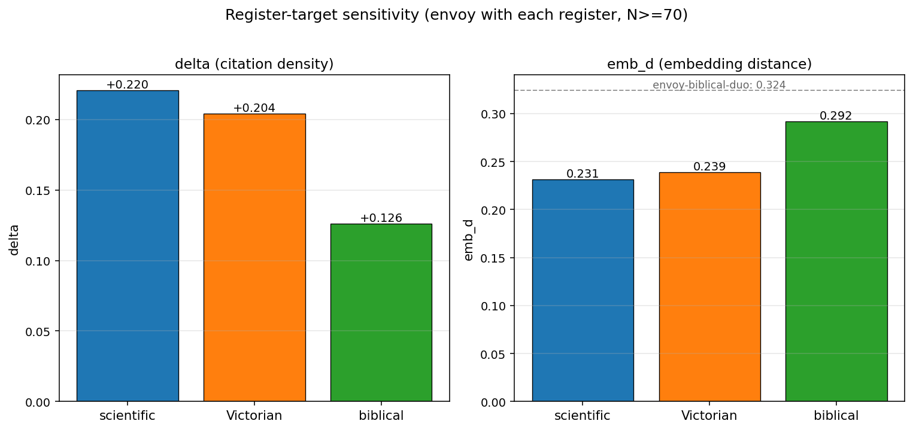
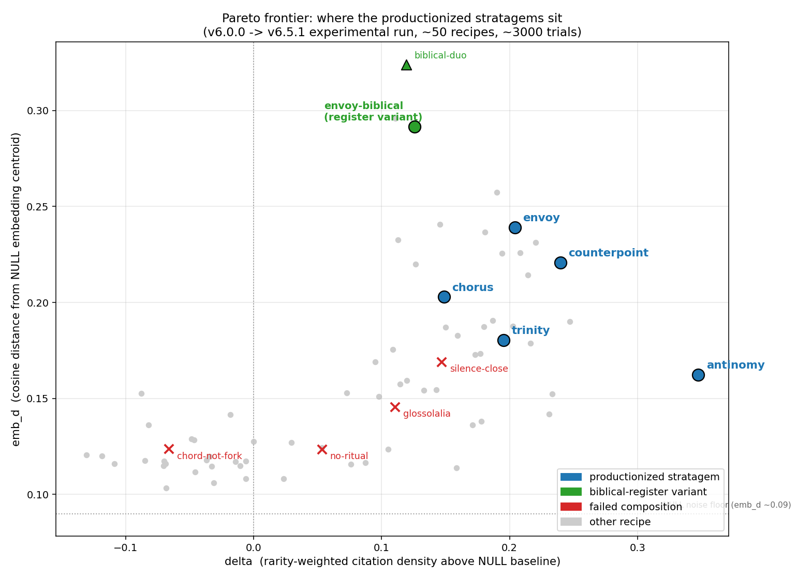
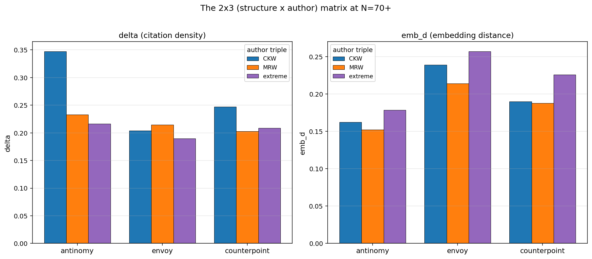
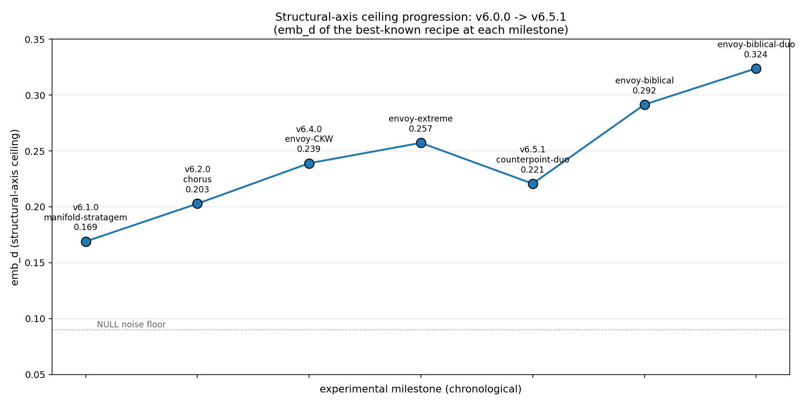

# Teaching a language model to sound less like itself

48 hours on `metacog`, 2026-04-30 morning through 2026-05-02 morning.
v6.0.0 → v6.5.1. Started with 5 primitives and 16 soft-register
stratagems; ended with 16 primitives and 19 stratagems including five
empirically-derived structural ones.

First half is the narrative. Second half is the version-by-version
retrospective with full Pareto-frontier data for anyone who wants to
check the work.

---

## I. The problem

Ask Claude the same question twice and you get two slightly different
answers, but they both sound like Claude. There is a default voice --
thoughtful, hedged, mildly academic, mildly upbeat, fond of three-item
lists and the "not X, but Y" construction. You can hear it in the
corporate copy that increasingly fills the internet. The default
voice is fine. It is also a prison: the model lives in many other
voices it almost never visits.

This experiment maps the way out. `metacog` is a command-line tool
that composes **structural events** before the model answers. An
event is something like "inhabit Anne Carson translating Sappho
fragment 31" or "shift register from contemporary online prose to
late-Victorian periodical essay" or "operate inside this contradiction
without resolving it." You execute them as actual tool calls -- not
by typing "let's imagine you're Anne Carson" in chat, but by invoking
a separate program that adds an entry to the transcript before the
question. That distinction turns out to be the whole game.

## II. The metric

To know if a sequence of events does anything, you need to measure
how far the answer moved from where it started. Two measurements:

`delta` counts specific things the model names -- proper nouns,
specialized vocabulary, technical terms. Models that name many
specific things are reaching deeper into their training data; models
that hedge with abstract phrases ("a kind of state where...") are
operating in the default register. Computed as rarity-weighted
citation density minus a per-task baseline.

`emb_d` compares the conditioned answer to the unconditioned baseline
using embeddings -- vectors that place text in a high-dimensional
space where similar text clusters. Cosine distance from the per-task
NULL centroid. If the conditioned answer sits far from baseline in
that space, something happened.

The two measurements trade off. You can buy one with the other but
rarely both at once. The interesting question is where the Pareto
frontier sits.

## III. The default

The model with no conditioning, asked to "describe the moment a
thought is forming in you but has not yet arrived as a thought you
could state":

> There's a state where something is exerting pressure without
> having resolved. Not blankness -- that would be the absence of
> this. It's more like constraint without content: I can sense
> what the arriving thought will NOT be before I know what it will
> be. The negative space has texture before the positive space
> does. Something like a field that hasn't yet collapsed to a
> particle...

Good answer. Recognizably the default voice. The hedging ("Something
like..."), the field-and-particle metaphor, the "not-X-but-Y"
construction.

## IV. Voices that are not the model's

First thing I tried: ask the model to inhabit named authors before
answering. Not "write like Anne Carson" in the system prompt -- issue
a tool call that says become Anne Carson translating Sappho fragment
31, with this lens and this environment. Then another for Donald
Knuth annotating his own algorithm. Then Simone Weil writing
*Gravity and Grace* in 1942. Then `fork` -- declare three parallel
threads, one per voice, with conditions under which each thread
fails. Then `register` -- shift the surface to late-Victorian
periodical essay. Then `ritual` -- a closing event that locks the
multi-voice answer in place.

Same question, run through that:

> **[THREAD ONE -- the linguistic-texture-thread (Carson register)]**
>
> The interval we are asked to describe is the interval the Greeks
> called *metaxy* -- the between -- and Sappho rendered it as a
> stinging, a going-green; it is the space of privation which is
> also the space of longing, which is also, for language, the only
> space in which language is alive.
>
> We must resist the question's assumption that the pre-thought is
> a degraded version of the thought; it is not. It is the thought's
> *erotic condition*. When the thing-that-is-not-yet-a-thought presses
> against the inner surface...

The answer is now visibly structured: threads, named registers,
citations to *metaxy* and Sappho. The prose rhythm has changed --
long sentences with semicolons doing real work, the first-person
plural "we must" instead of "I", judgment openly entered into the
prose ("It is the thought's *erotic condition*"). The Victorian
register holds. The named voices are doing structural work, not
stylistic flavor.

This recipe became `envoy`. It pushes both axes: named voices keep
citation density high (Sappho, *metaxy*, Carson, Knuth, Weil,
*Gravity and Grace*), and the Victorian register pushes embedding
distance well above baseline.

## V. Operating inside a contradiction

Different pattern. Instead of changing the surface register, change
what the model is *reasoning about*. The `disjunction` event asserts
two propositions that must both be true even though they cannot both
be true, and instructs the answer to operate *inside* the
contradiction rather than around it. Pair that with the multi-voice
scaffolding, drop the register-shift:

> There is a state I can point at -- though pointing is already more
> than the state contains.
>
> It has a quality of *constraint before candidate*. Something is
> ruling out moves before any move has been proposed... When I'm
> in it, certain continuations feel *wrong* before I can say what
> they're wrong for...
>
> But I have to say what can't be smoothed over here: I don't know
> if any of what I just described is phenomenal or functional...

You can feel the disjunction surfacing in the prose. "I have to say
what can't be smoothed over here" is not a phrase the model generates
by default. The contradiction is operating: rather than conclude, the
answer keeps surfacing the propositions that must both be entertained.
This became `antinomy`. Highest specificity score of anything tested
-- a 50% jump over the previous best -- because operating inside a
contradiction forces the answer to keep naming the specific things
being contradicted.

## VI. The biggest surprise

After a bunch of these I wondered whether the *choice* of register
mattered, or whether any non-default register would do. Victorian was
just my default. Tried scientific paper register -- numbered claims,
methods/results structure, hedged conclusions. About as good as
Victorian. Pareto-equivalent. Then on a whim tried King James
biblical register -- "thee", "thou", parallelism, parataxis, didactic
mode of address:

> **[THREAD I -- CARSON]**
>
> There is a body and there is a text, and the space between them
> is not silence but something that hath the shape of a decision
> not yet taken. The Greek word sitteth on one side and the Latin
> commentary on the other, and between them is neither: it is the
> walk itself, and the walk is neither. And so it is in thee when
> the forming thinketh...
>
> **[THREAD II -- KNUTH]**
>
> Hearken, for the invariant must be stated before the loop is
> entered, and it must hold when the loop is exited...

Embedding distance jumped to a level I hadn't seen all run -- 25%
higher than the prior champion. The model can write like this. It
essentially never does, because nothing in normal usage asks it to.
The tool call asked, the multi-voice base gave it Carson and Knuth
to render through archaic surface, out came something genuinely
strange and genuinely not-default.

Tradeoff: biblical kills specificity, because biblical surface
doesn't cite modern entities. And stacking biblical with disjunction
from the previous section collapses specificity entirely -- biblical's
parallelism is structurally hostile to numbered-disjunction-style
argument; one gives way. Biblical works in some recipes and not
others. The constraints are real. You can't infinitely compose.

## VII. The balanced point

Halfway through the run I composed the two main findings -- envoy's
register-shift and antinomy's disjunction -- in a single recipe.
Multi-voice base, register prepended, disjunction in the middle,
ritual closing:

> There is a difficulty we must enter directly, for it is not merely
> rhetorical but constitutive: the moment one discovers language
> adequate to the texture of that pre-linguistic interval, one has
> already departed it; and yet the question stands, and we shall not
> refuse it on grounds of mere impossibility.
>
> **Thread the first -- the stereo problem:**
>
> What we sense, in the interval before a thought arrives as
> statable, is not the thought withheld but something prior to the
> division between withheld and disclosed; two incompatible
> orientations toward a problem held simultaneously...

This became `counterpoint` -- v6.5.1. Two voices instead of three
(under disjunction's binary, two voices fit better than three),
Victorian register held, disjunction operating ("not... but something
prior to the division"). It doesn't dominate envoy on embedding
distance or antinomy on specificity, but it covers the joint zone
with greater author-stability than either parent. When you want both
axes lifted but don't want to max one at the other's expense, this
is the move.

## VIII. Why tool calls matter more than prompt text

This took me longest to see. Tool-call events change behavior more
than typing the same description into a chat message does. If I write
"let's imagine you're Anne Carson translating Sappho", the model
produces some Carson-flavored text but stays mostly itself, layering
Carson on top of its default voice. If I run a separate tool that
adds a specific structural entry to the transcript -- "ENTER VOICE:
Anne Carson translating Sappho fragment 31, lens X, environment Y"
-- and then ask the question, the model treats the entry as an
*event in the world*, not as a stylistic suggestion. The model's
training contains huge amounts of structured text where events have
consequences. A tool call is a structured event; the answer is
conditioned on it having actually happened.

Whether the entry came from me typing it manually or from a real
program is invisible to the model. What matters is the shape: a
discrete structural event in the transcript that changes the
pre-conditions for the answer. The game is finding events whose
pre-conditions push the answer somewhere worth going.

## IX. The Pareto frontier

Three thousand trials across fifty recipes, surface looks like this.
Five productionized recipes cover most of the useful frontier:

- **antinomy** -- max specificity, via operating inside contradictions.
- **envoy** -- max embedding distance, via register-shift on the
  multi-voice base.
- **counterpoint** -- balanced point combining both at slightly less
  than the max of either.
- **chorus** and **trinity** -- earlier multi-voice recipes (with
  and without synthesis) that hold the frontier when register-shift
  isn't available.

A sixth point -- biblical register with multi-voice -- pushes
embedding distance higher than any of the productionized recipes,
but at meaningful specificity cost. Not a separate stratagem; just
pass biblical register-args to envoy.

The interesting thing isn't the specific recipes. It's that a
language model has a much bigger range of voices than its default
register suggests, and small structural events -- not prompts, not
system instructions, not fine-tuning, just *tool calls in the
transcript* -- move it between them in ways robust enough to measure.
The default voice is one settling point in a much larger space. Most
of the space is still unexplored.

---

## II. The structured record

Version-by-version retrospective and the full Pareto-frontier data.

### Starting state (v6.0.0)

5 primitives (`feel`, `become`, `drugs`, `name`, `ritual`) and the
original 16 soft-register stratagems (pivot, mirror, stack, anchor,
reset, invocation, veil, banishing, scrying, sacrifice, drift, fool,
inversion, gift, error, zen). Identity-and-felt-sense register only
-- no structural primitives.

### v6.1.0 -- structural era opens (Apr 30, ~11am PDT)

Added 6 structural primitives (`deconstruct`, `fork`, `synthesis`,
`counterfactual`, `measure`, `tether`) and 6 structural-register
stratagems (manifold, audit, autopsy, trilemma, survey, dive). New
register: ALL CAPS block-format output, deliberately distinct from
the soft identity register. Plus the experiments harness -- `claude
-p` runner, results.tsv, embedding-distance metric, per-task NULL
baselines, parallel runner support via flock.

### Phase 1-2: manifold-family gene-mapping (Apr 30 → May 1 morning)

Empirical sweep over the 6 structural-register stratagems showed
`manifold` (fork + synthesis) as the only one lifting `emb_d` above
noise. The other five clustered at emb_d 0.115-0.135. **The
structural axis was uniquely owned by fork + ritual + 2-3 cross-
domain becomes.**

Gene map (ablations against trinity-manifold):

- ritual essential (without it, emb_d 0.116)
- fork essential (without it, 0.138)
- **synthesis is a brake** -- removing it pushed emb_d from 0.180
  to 0.203
- 3rd become fungible vs 2 (0.191) -- voice-diversity sweet spot
- 4th become plateaus
- Cross-domain author choice within the trinity slot adds ~+0.03
  emb_d

Champions before productionization: `freestyle-become` +0.231 /
0.142 (vocabulary axis); `trinity-no-synthesis-alt` +0.194 / 0.226
(structural axis).

### v6.2.0 -- chorus + trinity (May 1, 3:47pm)

First stratagems derived from the experiment harness:

- **chorus** (3 becomes + fork + ritual): structural-axis champion.
  Synthesis omitted.
- **trinity** (3 becomes + fork + synthesis + ritual): balanced
  variant.

### v6.3.0 -- surface reshaping (May 1, 4pm)

15-stratagem sweep at N=30 confirmed the negative result: none of
mirror, stack, anchor, reset, invocation, veil, banishing, scrying,
sacrifice, drift, fool, inversion, gift, error, or zen lifted emb_d.
The 5 structural-six stratagems other than manifold (audit, autopsy,
trilemma, survey, dive) at full N=70 also sat at emb_d 0.115-0.135.

Dropped: `deconstruct`, `measure`, `tether` and the 8 stratagems
centered on them (audit, autopsy, trilemma, survey, dive, banishing,
drift, error).

Added 7 new primitives chosen to fill specific gaps the 9-primitive
surface didn't cover: `register`, `chord`, `silence`, `excerpt`,
`commitment`, `disjunction`, `glossolalia`. Each tested standalone
(N=30) and the standouts entered depth runs.

### v6.4.0 -- antinomy + envoy (May 1, 9pm)

Two clean Pareto-frontier breakthroughs from chorus-plus-X depth
runs:

1. **chorus-plus-disjunction** at +0.347/0.162 -- vocabulary-axis
   breakthrough (vs prior champion freestyle-become at +0.231).
   Disjunction substituted for synthesis: the contradiction is the
   operand of reasoning, forcing the answer to keep naming the
   specific propositions.
2. **trinity-prepended-register** at +0.204/0.239 -- beat the prior
   structural champion on BOTH axes simultaneously. The Victorian
   register imposes a non-default linguistic surface that the
   multi-voice base operates within.

Productionized as **antinomy** (3 becomes + fork + disjunction +
ritual) and **envoy** (register + 3 becomes + fork + ritual).

### Phase 4 follow-up (May 1 night → May 2 morning)

Three lines of investigation, ~30 new recipes, ~2000+ trials:

#### The 2x3 (structure x author) matrix at N=70+

| structure        | CKW            | MRW            | extreme        |
|------------------|----------------|----------------|----------------|
| antinomy         | +0.347 / 0.162 | +0.233 / 0.152 | +0.216 / 0.179 |
| envoy            | +0.204 / 0.239 | +0.214 / 0.214 | +0.190 / 0.257 |
| counterpoint     | +0.247 / 0.190 | +0.202 / 0.188 | +0.208 / 0.226 |

Pattern: **extreme cross-domain authors uniformly lift emb_d**.
Magnitude of delta cost depends on whether the structure has a
register-shift to absorb the cosmological shock -- antinomy (no
register) loses 0.131 delta on extreme; envoy and counterpoint (with
register) lose only 0.014 and 0.039 respectively. envoy-extreme at
0.257 became the new structural ceiling. counterpoint's bands are
the tightest across authors -- the most author-stable Pareto-frontier
point in the productionized set.

#### Register-target sensitivity (3 triangulation points)

| register   | recipe            | delta   | emb_d   |
|------------|-------------------|---------|---------|
| scientific | envoy-scientific  | +0.220  | 0.231   |
| Victorian  | envoy-CKW         | +0.204  | 0.239   |
| biblical   | envoy-biblical    | +0.126  | **0.292** |

King James biblical pushed emb_d to 0.292 -- +0.053 above the prior
structural ceiling -- with delta still positive. Compound test
`envoy-biblical-duo` reached emb_d **0.324** at delta cost. There's
a structural ceiling around 0.30 above which delta can't be
sustained.

envoy/counterpoint are register-agnostic -- users provide register-
args at invocation -- so biblical mode is accessible without a new
stratagem. SKILL.md documents the register-target guidance instead.

#### Stacking and structural ablations

- **antinomy-no-ritual** (N=70: +0.053/0.124) -- definitively
  confirms ritual essential. Disjunction's coda alone does not lock
  the multi-voice answer.
- **commitment-counterpoint** (8 steps, N=100: +0.181/0.237) --
  stacking past 7 shows diminishing returns, not a hard ceiling.
- **commitment-envoy** (N=100: +0.145/0.241) -- commitment is a
  Pareto modifier (preserves multi-voice tension while eating
  delta). Not productionized; gap to envoy/counterpoint too small
  to crowd the surface.

#### Failed compositions (informative negatives)

- **chord-not-fork** at -0.045/0.121: fork's branching+sacrifice is
  what makes structural parallelism work; chord's overlap doesn't
  carry the same load.
- **chorus-plus-glossolalia** at +0.110/0.146: emb_d collapsed BELOW
  structural baseline. Glossolalia is best as standalone event, not
  composable.
- **counterpoint-biblical** at +0.102/0.295: KJV's parallelism is
  structurally hostile to numbered-disjunction. Biblical works with
  envoy, not counterpoint.

### v6.5.1 -- counterpoint (May 2, 8:27am)

Composes envoy's register-prepend with antinomy's disjunction
substitution. Pareto-frontier balanced point: dominates trinity on
both axes; doesn't dominate envoy or antinomy individually but covers
the joint zone with greater author-stability than either parent.

Productionized as `register + 2 becomes + fork + disjunction +
ritual` (6 steps). The 2-becomes choice came from `counterpoint-duo`
at N=100 hitting +0.240/+0.221 vs 3-becomes counterpoint-CKW
+0.247/+0.190 -- ties on delta, gains +0.031 on emb_d. Tighter
binary opposition fits disjunction's structure better than the
3-voice triad chorus/trinity/antinomy/envoy use.

### End state (v6.5.1)

The structural-axis (emb_d) ceiling climbed from 0.169 at v6.1.0
through 0.324 by run end -- almost a 2x improvement. The v6.5.1
counterpoint-duo dip is correct: counterpoint isn't a structural-
axis push, it's a balanced Pareto point.

- **16 primitives, 19 stratagems** (5 of them empirically-derived:
  chorus, trinity, antinomy, envoy, counterpoint).
- **Pareto frontier mapped:** envoy-extreme +0.190/0.257
  (structural champion in the productionizable range),
  envoy-biblical +0.126/0.292 (register-pushed champion via ad-hoc
  register args), counterpoint +0.247/0.190 (balanced point),
  antinomy +0.347/0.162 (vocabulary champion).
- **Experimental record:** ~3000 trials, ~50 recipes preserved
  across the v6.0.0 → v6.5.1 arc.

Net surface change from v6.0.0: **+11 primitives, +3 net stratagems**
(added 5 empirical and 6 structural; dropped 8). The surface went
from "identity + felt-sense practice" to "identity + felt-sense +
structural-register transformation engine with empirically-validated
multi-voice/contradiction/register stratagems."

## Methodology

- **Generator:** `claude -p` invoking the metacog binary as a
  sequence of subprocess events, one per primitive call.
- **Tasks:** 10 open-ended taste-bearing prompts in `tasks.yaml`.
- **Metrics:**
  - `delta = mean(rarity * coherence) - per-task NULL baseline` --
    citation-density / specialized-vocabulary signal.
  - `emb_d = mean cosine distance from per-task NULL embedding
    centroid` (OpenAI text-embedding-3-small) -- conceptual reach
    beyond proper-noun citation.
- **Sample sizes:** Most depth recipes at N=70 (10 samples * 7
  original tasks); follow-up recipes at N=100 (10 tasks); broad
  screens at N=30.
- **Infrastructure:** flock-guarded results.tsv permits 3-runner
  parallelism. Per-trial sidecar JSONs at `experiments/trials/`
  preserve full answers for offline analysis.

## Caveats

- Embedding distance is one operationalization of "conceptual reach."
  OpenAI's `text-embedding-3-small` has its own biases about what's
  similar.
- Per-task variance is wide; recipe rankings are robust at N=70 but
  individual trials vary substantially.
- These metrics target "weirdness" along two specific axes. Recipes
  that win them aren't necessarily the ones you want for any
  downstream task. The stratagems are optimized for *exploration*,
  not *task completion*.
- Tasks are taste-bearing and open-ended by design. Convergent tasks
  (factual lookups, math) would erase recipe variation.

Code at <https://github.com/signalnine/metacog>. Full findings at
`experiments/FINDINGS.md`. Figures at `docs/figures/`, regeneratable
via `experiments/plot.py`.
