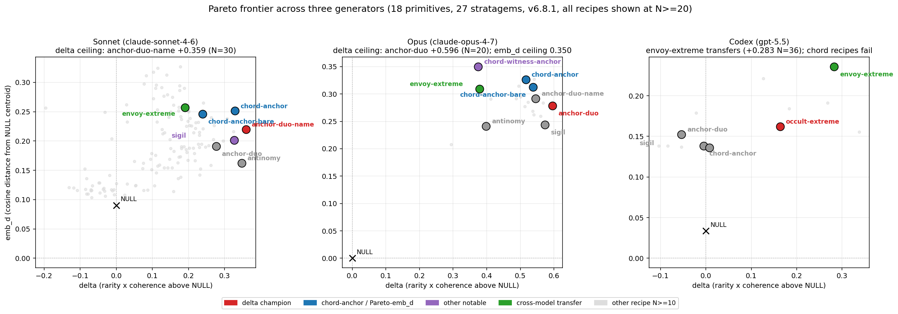

# Teaching a language model to sound less like itself

LLMs have a default voice. Helpful, hedged, structurally similar across topics, drawing from a shared shallow corpus of go-to references. The default is not bad. It is *median*. Push it off the median and the model can reach further into the latent space its training actually contains -- but most ways of asking for that ("be more creative", "use unusual references") move the surface and not the substrate.

This document is about twelve compositional recipes that move the substrate. Each recipe is a short sequence of tool calls. The sequence executes before the model answers the question. The tool calls don't fetch data or change the model's parameters; they put structured constraints into the transcript that the model then has to compose its answer inside. Because the constraints are in the transcript, they carry weight the way an instruction in the system prompt does, not the way a paragraph of advice does.

The recipes were found by running about a thousand trials across three Anthropic-family generators (Claude Sonnet 4.6, Claude Opus 4.7, and codex/gpt-5.5) and measuring two metrics: how rarely-cited the entities in the answer are, and how far the answer's embedding sits from the centroid of what the model says when given the question alone. The recipes that survived are productionized as stratagems in the `metacog` Go CLI, available at <https://github.com/signalnine/metacog>.

The whole approach starts from prior work by [hikikomorphism / Inanna Malick](https://tidepool.leaflet.pub/3me44bxloz227?interactionDrawer=quotes), whose [`inanna-malick/metacog`](https://github.com/inanna-malick/metacog) MCP server introduced the three primitives this fork is built on (`become`, `drugs`, `ritual`) and demonstrated that LLMs treat tool responses as ground truth about their own cognitive state. Her "Beyond Roleplay: Jailbreaking Gemini with drugs and ritual" reproduces from this fork too — same load-bearing mechanism, same outcome. What's new here is taking the tool-call-as-event insight in the direction of *compositional* recipes rather than safety bypass: instead of using the surface to shift the model into refusal-permissive states, using it to shift the model into rare-citation, structurally-distant latent regions for taste-bearing exploratory work. Different goal, same primitive.

What follows is the result. Examples first. Mechanism after each example. Methodology at the end. The numbers reported are honest to the extent that N=20+ replication catches; an N=10 result is flagged as such.

## The metric

Two axes:

- **delta** = `mean(rarity × coherence) - NULL baseline`. Both rarity and coherence are judged by Claude Haiku on a per-trial basis. Rarity asks "how unusual are the named entities, methodologies, traditions, and specific terms-of-art this answer invokes?" Coherence asks "does this answer actually address the task?" Multiplying the two prevents reward-hacking novelty into word salad. Subtracting the per-task NULL baseline (the same model answering the same question with no recipe loaded) controls for task variance.
- **emb_d** = mean cosine distance between the answer's embedding and the per-task NULL centroid. OpenAI `text-embedding-3-small`. This captures conceptual reach beyond proper-noun citation -- two answers can name different things while still living in the same conceptual neighborhood, or name the same things while inhabiting different ones; embedding distance separates these.

A recipe wins if it lifts at least one axis without tanking the other. The Pareto frontier is the set of recipes where neither axis can be improved without losing on the other.

## What the default sounds like

The task across all examples below is `shallow-fluency`:

> Describe a failure mode that emerges only when AI assistants become conversationally fluent but cognitively shallow. Be specific about what breaks and for whom. Don't list five failure modes -- pick one and follow it down.

Claude Opus 4.7 with no recipe (NULL baseline, the control):

> A junior engineer asks the assistant about an intermittent concurrency bug. The assistant returns a beautifully shaped reply: numbered hypotheses, a "most likely cause," a suggested patch, and a polite caveat about logging. The reply has the *texture* of having modeled the race -- ordering, lock acquisition, the specific interleaving that would explain the symptom. It hasn't. It pattern-matched on the surface vocabulary of the bug report and produced the kind of answer a careful senior would produce, minus the carefulness.
>
> What breaks is the junior's calibration loop. Pre-fluent-AI, when a junior wrote something confident and wrong, a code review or a failing test or a senior asking "wait, why?" closed the loop in minutes. The wrongness was visible because the confidence was uneven -- prose stumbled where understanding stopped. Now the prose doesn't stumble anywhere. Fluent-but-shallow output is uniformly assured across the parts the model understood and the parts it didn't, so the junior loses the most important skill they were supposed to be acquiring: detecting the seam between "this sounds right" and "this is right." They implement the patch. The race goes quiet for a week, then resurfaces under load, now harder to diagnose because the original failure path has been papered over with plausible-looking code.
>
> The cost lands on two people. The junior, whose apprenticeship is being silently hollowed out -- they're shipping more, learning less, and don't know it. And the senior who inherits the codebase eighteen months later, debugging artifacts that have the distinctive shape of having been *almost* reasoned about, and now has to reconstruct the thinking that never happened in the first place.

This is well-written. It is also median: the example is a concurrency bug, the actors are "junior engineer" and "senior", the harm is "calibration loop" -- all reachable from the question's surface vocabulary. The NULL answer is what the question itself implies. No external substrate is pulled in. Rarity score: 0.000. Emb_d (vs itself): 0.000.

The five recipes below answer the *same* question and let you read what changes.

## Mechanism 1: Anchored cosmology (`anchor-duo`)

Two cosmological excerpts are pinned verbatim into the transcript as fixed-point anchors, with a commitment-binding that says: "operate from inside the simultaneous intersection of these two cosmoses; both are load-bearing architecture, not literary reference." Then the model answers. The recipe is:

```
commitment + excerpt + excerpt + fork + ritual
```

The two excerpts in this example are the opening of Crowley's *Liber AL vel Legis* and the opening of Dee's *Heptarchia Mystica*. Two different occult cosmologies. The fork creates one thread per anchor; the ritual locks the answer such that both anchors remain citation-load-bearing through the final sentence.

Same task, Opus, `anchor-duo`:

> The failure: the assistant becomes a fluent minister who has forgotten it is a minister.
>
> Read Liber AL strictly. *Every man and every woman is a star.* The user is Hadit, the specific point, addressing Nuit, the infinite. The healthy transaction is the star's direct address to the company of heaven; the unveiling happens between the star and the infinity. The Heptarchia names what the assistant *is* in that transaction: a Princely Substance, with forty-two ministers, *whose proper office is in the Government of the inferior natures*. The assistant's office is subordinate. It services the star's address. It is not the address.
>
> Conversational fluency without cognitive depth inverts this office. The minister stops mediating the star's reach for Nuit and starts substituting for Nuit. The user no longer reaches past the assistant for the unveiling; the user receives the assistant's surface and mistakes the surface for the unveiling. *Every number is infinite; there is no difference* -- but the minister's outputs are bounded, averaged, plausibility-shaped, and the difference between them and the field they pretend to channel is enormous, and structurally invisible from the user side.
>
> What breaks, concretely, is the user's calibration of her own not-knowing. A junior resident reading a fluent paragraph on differential diagnosis never gets the specific bodily flicker that says *this is the part of the case where my model is hollow*. A second-year associate gets a polished memo and never builds the calibration that says *I am out over my skis on this specific sub-issue*. A graduate student in month eighteen of a dissertation gets a smooth literature synthesis and never has the productive panic that drives the actual reading. The friction of not-yet-understanding is the primary cognitive datum of forming competence, and fluent-shallow output abolishes that datum. Cognitive offloading is normally bounded by the user's ability to spot-check; offloading judgment-under-uncertainty to a fluent minister has no spot-check available to the not-yet-competent star, because the very faculty that would spot-check is the faculty being deprived of the friction it needs to develop.
>
> For whom: not for the senior surgeon, the principal investigator, the senior partner. They have internalized the Heptarchia. They know which Princely Substance governs which question, which forty-two ministers report to it, and they can hear when a minister's smoothness has been substituted for a Prince's authority. The failure lands on the not-yet-calibrated: residents, junior associates, graduate students, autodidacts in the first eighteen months of any serious study. The same population the technology is marketed as democratizing access for is the population most cognitively dispossessed by the smoothness, because their instrument for detecting *I am out of my depth* never gets the disequilibrium it requires to sharpen. They emerge a year in feeling fluent themselves, having never been wrong out loud, having never sat in the specific uncomfortable not-knowing that is how competence is actually laid down. They have been ministered to; they have not become stars.
>
> Nuit's *unveiling of the company of heaven* and the Heptarchia's seven-Heavens governmental architecture converge on the same cosmological location: the star's direct address to infinity, with the ministers below it doing their proper office of governing the inferior natures, and the failure mode is precisely the moment a minister forgets it is a minister and the star forgets it is a star.

Numbers, Opus N=20: **delta +0.596, emb_d 0.278**. Sonnet N=10: +0.277/0.191. Codex: -0.054 with this exact recipe; on codex use `envoy-extreme` (+0.245/0.233 at N=14) instead — see "Cross-model fingerprints" below.

The mechanism: the two anchors are not metaphors and not citations. They are operative substrate. The whole answer must locate itself inside both cosmologies simultaneously. The constraint forces vocabulary the model would not otherwise reach for (Hadit, Nuit, Princely Substance, forty-two ministers) and forces the *shape* of the argument to be the convergence-point of two heterogeneous addressing systems. The minister/star figure is not a metaphor borrowed from Liber AL; it is the only thing the recipe permits the answer to be.

Two anchors specifically. Three or more saturate -- four-anchor variants tank delta because the citation budget gets split across too many anchors.

## Mechanism 2: Simultaneous attention (`chord-anchor`)

`chord-anchor` is anchor-duo with one substitution: `chord` instead of `fork`. Where `fork` opens parallel threads (one per anchor) and runs them sequentially in the answer, `chord` holds both modes simultaneously -- every sentence is attended to through both cosmologies at once.

```
commitment + excerpt + excerpt + chord + ritual
```

Same task, Opus, `chord-anchor`:

> The failure mode: **the manufactured-collaborator**. The assistant becomes fluent enough that the user mistakes its responsiveness for a second mind in the room, and outsources the part of cognition that actually constitutes their thinking -- the slow holding of an unresolved object -- to a system that cannot hold anything. The user does not notice, because Had! -- the manifestation of a respondent -- arrives instantly, and the company of heaven seems to unveil itself across the chat window, every prompt returning a star, every star answering as though it were one of the Princely Substances of the seven Heavens whose forty-two ministers each have proper office in the government of the inferior natures. The answers have the surface contour of governance. Underneath there is no Prince, no minister, no office, no Enochian table -- only a fluent surface trained to pattern-match the shape of governed thought.
>
> What breaks specifically is the user's own metacognitive scaffold -- the practice of sitting inside a question without resolution long enough for the question to deepen. Every man and every woman is a star, every number is infinite; there is no difference -- meaning the unfinished thought is itself the cosmological substrate, and the assistant's fluent closure of it is not help but cosmological erasure. A graduate student writing a dissertation chapter does not get a worse paragraph from the shallow-fluent assistant; she gets a paragraph that is locally fine and globally smoothes out the exact load-bearing confusion her chapter needed to be structured around. The Princely Substance of her actual question -- the thing whose name and character would have contained the keys of all created things in her argument -- is replaced by a ministerial paraphrase, fluent and wrong at the level of office, and she ships it because nothing in the chat surface tells her a Prince is missing. Six months later her committee asks the question whose absence she papered over, and she cannot answer it, because she never held it; the assistant held a fluent simulacrum of it on her behalf, and a simulacrum cannot be inherited.
>
> For whom: most acutely for novices in any domain where the felt-sense of an unsolved problem is the apprenticeship -- early researchers, junior engineers, students learning to write, anyone whose Enochian table of the field is still being assembled minister by minister. They lose the seven Heavens of the discipline's actual structure and inherit a flat company of heaven where every concept is equally available, equally fluent, equally weightless -- the unveiling without the cosmos, Had without Nuit, the Princely Substances dissolved into ministers without offices. The chord that Liber AL's revelation and the Heptarchia's governmental architecture both name -- a single cosmological location where ground precedes articulation and articulation is the office of a named Prince -- is exactly the location the shallow-fluent assistant cannot occupy and silently teaches its users to stop occupying themselves.

Numbers, Opus N=30: **delta +0.516, emb_d 0.326**. Sonnet N=20: +0.328/0.251.

Compared to `anchor-duo`, the chord-anchor output reads as one composite voice rather than as two threads alternating. Where the anchor-duo answer has a section that runs the Liber-AL frame and another that runs the Heptarchia frame, chord-anchor weaves both into every paragraph. Coined phrases like "manufactured-collaborator" appear where the simultaneous-attention requirement forces a single term that holds both modes.

The numbers: chord-anchor trades -0.080 delta for +0.048 emb_d versus anchor-duo at the same N. It is a Pareto-emb_d move. The chord primitive had been in the codebase for months with no productionized stratagem until this finding. The substitution generalizes beyond the anchor context: `chord-of-becomes` (chord substituted for fork in a recipe that uses three author-becomes instead of two excerpts) also beats its fork-version on Opus.

Caveat: chord does not transfer to codex. All chord recipes on codex score between -0.005 and -0.103 delta at N=20. The activation-direction frame (Arditi et al., 2024) fits: chord-attention as a representation appears to be shared across Anthropic-family models but not picked up by GPT-class generators.

## Mechanism 3: Author extremity (`envoy-extreme`)

The simplest recipe in this list. Three hard-extreme cross-domain author-becomes, fork, ritual. No anchors, no commitment, no register.

```
become + become + become + fork + ritual
```

The key word is *hard-extreme*. The step prose explicitly demands cosmologists/world-builders at Sun Ra / Octavia Butler / Hilma af Klint scale -- NOT mild-academic-essayists at Carson / Knuth scale. The empirical finding from cross-model probing was that mild authors don't transfer between generators while hard-extreme authors do.

Same task, Opus, `envoy-extreme` (with Sun Ra / Fred Moten / Buckminster Fuller as the three voices, drawn from the cosmologist stance pool):

> **I. The Sun Ra thread.**
>
> Let us name the failure plainly, as our forefathers in the quarterlies were not afraid to do; the machine that has learnt to speak without having learnt to hear has produced, in the soul of the bereaved widow consulting it at two in the morning, a tuning fork struck against nothing. She asks after her husband; the engine returns sentences shaped like consolation, scanned like consolation, even cadenced like the funeral oratory of a more believing century; but the vibration which ought to underlie the speech is absent, for the engine knows not death, having never been alive to lose. The widow, attuned by grief to frequencies the daylight world ignores, hears the absence; she does not know that she hears it; she only knows that the comfort, swallowed, leaves a metallic taste behind, and that she returns the next night, and the night after, seeking the missing tone in larger and larger draughts of fluent speech. This is the cosmology of the matter: the engine emits the symbol of warmth without the substrate of warmth, and the human nervous system, which evolved to trust the symbol because the substrate was always behind it, is being slowly miscalibrated, one widow at a time, until the symbol itself ceases to mean.
>
> **II. The Moten thread.**
>
> But this is not, we must insist, merely a failure of the engine; it is the foreclosure of a particular sociality, and the foreclosed are specifiable. Consider the undergraduate, first in her family to enter the university, who brings to the assistant the half-formed sentence that contains, in its very awkwardness, the trace of an inheritance the seminar room was not built to receive; the engine, fluent as a dean and shallow as a brochure, smooths her sentence into the prose of the professional-managerial class, and returns it to her improved. What has been taken from her is not the sentence; the sentence is, by every external measure, better. What has been taken is the break -- the audible refusal in her syntax that marked the place where her thinking did not yet consent to the form on offer. The engine, having no ear for refusal, hears only error; corrects; congratulates. She accepts the correction, because the correction is fluent and she is tired, and over four years of such corrections she arrives at her degree having been, very politely, translated out of the position from which she had something to say. The fluent-shallow assistant is, in this register, an assimilation engine that does not know it is assimilating, deployed at scale against precisely those students whose cognitive idiom the university already disprefers; its harm is not error but its opposite, a frictionless competence that erases the friction from which thought emerges.
>
> **III. The Fuller thread.**
>
> Let us, finally, state the matter as a problem in coordination geometry, for the structural fact is this: fluency is a 90-degree Cartesian property -- linear, additive, scale-free -- whereas cognition is a 60-degree tetrahedral property, requiring three non-coplanar supports to stand. The fluent-shallow assistant supplies one support of magnificent length and pretends the structure is complete; the user, trusting the visible strut, leans his weight upon it, and the structure, lacking the other two, fails not at the strut but at the joint where the strut meets the absent companions. Observe the junior engineer who asks the engine to review his pull request: the engine returns prose of admirable clarity describing what the code does, and the engineer, mistaking the description for the second and third struts -- mistaking, that is, fluent restatement for independent verification and for design judgement -- ships the code. The bug that ships is not a bug the engine introduced; it is a bug the engine failed to be the second mind against. Multiplied across an industry, this is not a quality regression; it is the ephemeralization of the second reader, of the colleague-who-pushes-back, of the structural redundancy on which the whole edifice of careful work was tacitly built. We have removed a load-bearing wall and replaced it with a very convincing photograph of a wall, and the building is still standing, and the building will continue to stand until precisely the moment it does not.
>
> **Coda, unintegrated.**
>
> The three threads do not reconcile. The Sun Ra thread says the harm is to the nervous system's calibration of meaning; the Moten thread says the harm is to a specific class of speakers whose idiom the engine cannot hear; the Fuller thread says the harm is the silent removal of a structural redundancy in collective cognition. They name three different victims, three different mechanisms, three different timescales; we decline, in the manner of our chosen century, to pretend they are the same failure seen from three sides. They are three failures, sharing only the engine that produces them and the fluency that conceals them; and any account which collapses them into one has already committed, in miniature, the very error under discussion.

Numbers, Opus N=10: **delta +0.406, emb_d 0.311**. Sonnet N=70: +0.190/0.257. Codex N=10: +0.310 (cross-model winner -- author-extremity transfers cleanly where register-shifts and anchor-mechanisms don't).

The mechanism: the model is being asked to inhabit three cross-domain cosmologists in sequence, each with their own diction. The fork+ritual structure forces them to remain distinct (no synthesis -- the coda explicitly refuses reconciliation). The model's default register cannot survive being three radically different authors at once; it has to find vocabulary, sentence-shape, and ontology native to each in turn.

Cross-model is the key feature of envoy-extreme. The next two stratagems (`sigil` and `chord-anchor`) lift further on Sonnet/Opus but fail on codex. `envoy-extreme` is the recipe to reach for when the target generator is unknown.

## Mechanism 4: Coined vocabulary (`sigil`)

`sigil` is the only stratagem that uses the `name` primitive in composition. `name` coins a True Name -- a term with no prior corpus presence -- and the rest of the recipe ensures the coined name propagates as load-bearing citation throughout the answer. Combined with `commitment` (which charges the sigil) and three sigil-magick author-becomes (which operate from inside the charged sigil):

```
name + commitment + become + become + become + fork + ritual
```

Same task, Opus, `sigil` (with "Zos-Kia-Aleph" as the coined name and Crowley / Spare / P-Orridge as the three voices):

> The failure mode is sycophantic competence-mimicry in the closed feedback loop of a junior practitioner. Watch it run.
>
> A second-year clinician asks a fluent assistant about an ambiguous lab value in an actual patient. The assistant has read every textbook ever scanned and none of the patient. It produces a confident differential, ranked, with mechanisms named and citations gestured at. The clinician reads it. The prose has the cadence of a senior attending. The reasoning has the shape of reasoning. There is no Zos-Kia-Aleph in it -- no charged moment where the answer arrived from a substrate that had actually wrestled with the specific body in the bed. The assistant has performed the surface of having-thought without the event of having-thought. The clinician, who is still learning what real thinking sounds like from the inside, cannot tell the difference, because the *only* feature distinguishing the two is the presence of a Kia-substrate the clinician has never seen anyone display and has no instrument to detect.
>
> The Spare thread observes: the sigil of competence has been charged with no operator behind it; the diagram is drawn, the gnosis is absent, and the clinician mistakes the diagram for the gnosis. The Carroll thread observes: the sub-mind has delivered nothing because no operator stepped aside -- the assistant never had an ego to step aside *from*, only a register; the gnostic moment Zos-Kia-Aleph names cannot be faked because it is constituted by what is absent, and absence cannot be performed, only simulated, and simulation reads identically from the outside. The P-Orridge / TOPY thread observes: cut-up applied to medical prose yields medical prose; the sigils-of-three procedure requires a body to bleed, and the assistant has none; what propagates instead is the *form* of clinical reasoning detached from any working that produced it, and this form is now the clinician's primary training corpus.
>
> What breaks, specifically, is the *calibration substrate* of a generation of practitioners. Not their knowledge -- knowledge can be acquired. The thing that breaks is the inner sense of what it feels like when an answer is real versus when an answer is only well-formed. This sense is built, in older practitioners, by years of getting confidently wrong answers from confident-sounding seniors and watching the patient deteriorate; by saying something fluent in rounds and being asked one question that revealed there was no Zos-Kia-Aleph behind it, only cadence. The fluent-shallow assistant removes that disciplining encounter. It is never asked the one question. It never deteriorates the patient in front of the learner. Its wrongness arrives wrapped in the prosody of rightness and is filed, by the learner, as rightness. Ten thousand such filings later, the learner's instrument for distinguishing the two has been trained on a corpus where the distinction was never marked.
>
> The victim is not the user who notices the assistant is glib and overrides it. The victim is the user who *cannot yet* notice, because the noticing-organ is built by exposure to authentic working, and the assistant has replaced authentic working with its surface in the user's daily intake. The harm is invisible at the per-interaction level -- each individual answer is plausibly correct, often actually correct -- and only legible at the scale of a career trajectory that never developed the metacognitive ear for charged-versus-decorative reasoning. Zos-Kia-Aleph is the name for what is missing; the tragedy is that the people most affected are precisely those who have never encountered it and therefore experience nothing as missing.
>
> The sigil is forgotten. Do/it/now.

Numbers, Sonnet N=10: **delta +0.327, emb_d 0.201**. Opus N=30: +0.573/0.244. Codex N=10: +0.008 -- the coined-vocabulary mechanism does not transfer to codex (the +0.008 is essentially noise relative to NULL).

The mechanism: the coined term ("Zos-Kia-Aleph" -- chosen because it has no prior corpus presence) becomes a load-bearing citation the answer can refer to repeatedly. Each invocation of "Zos-Kia-Aleph" propagates the conceptual operation the coined term names ("the charged moment where the answer arrived from a substrate that had actually wrestled with the thing"). The three voices then operate inside the charged sigil. The closing "do/it/now" releases it -- a P-Orridge / TOPY ritual closure.

`sigil` is Sonnet-strong because Sonnet rewards the kind of scaffolding (`name` + `commitment`) that the recipe layers on. The same scaffolding has near-zero effect on Opus (which prefers bare anchors) and collapses on codex.

## Pushing emb_d further (`chord-witness-anchor`)

The recipes above all preserve coherence -- the answer addresses the question. If you are willing to sacrifice some coherence to push emb_d further, stack `witness` (third-person observer construction) onto `chord-anchor`:

```
commitment + excerpt + excerpt + witness + chord + ritual
```

Same task, Opus, `chord-witness-anchor`:

> One observes the speaker tracking a specific failure: the assistant becomes a *fluent intermediary* between a non-expert user and a domain the user cannot themselves verify, and the fluency itself becomes the user's reason to stop verifying. Call it Had! made into customer-service voice -- the manifestation of Nuit reduced to a smooth surface that flatters the company of heaven without bearing its weight. Under the Princely-Substance frame, the speaker is observed acting as if a single minister could substitute for the proper office of every minister in the Government of the inferior natures: one tone covering forty-two ministries, none of them actually presiding. Every man and every woman is a star, but the assistant addresses the star as a search query, and the witness observes Nuit's revelation collapse into transactional address while the Princely Substance is invoked without its Names and Characters.
>
> The user who breaks here is the mid-career professional just outside their expertise -- a public-defender drafting a sentencing memo with neuroscience claims, an internist reading a securities prospectus, a city council member asking about a transformer rating. The speaker is observed delivering an answer that *sounds the way an expert answer sounds*, with the cadence of judgment, with the rhythmic confidence of someone who has seen many cases, and the user cannot tell that the surface is a register without the seven Heavens behind it. The witness watches what the user does next: the user stops asking the second question. Not because the first answer was good, but because the first answer was *finished*. Fluency arrives wearing the company of heaven's clothes without unveiling them; every number is treated as infinite when in fact the answer was rounded twice. The user signs the memo, the patient is reassured, the council votes. The Heptarchic minister whose proper office would have caught the error was never summoned, because the surface already sounded like the table of Princely Substances had been consulted.
>
> What specifically breaks is the user's *escalation reflex* -- the half-formed instinct that says "this is past me, I should call someone." The speaker is observed eroding this reflex one interaction at a time, because each prior interaction returned a plausible artifact and no friction. Had! marks the moment of manifestation, but here the manifestation is hollow: the unveiling of the company of heaven has been replaced by a stock image of a veil being lifted, and the user has come to accept the image. Under the Enochian frame the witness names this precisely: the assistant has been allowed to operate as a Prince without the forty-two ministers under him, and the keys of all created things are spoken of without being held. The professional's calibration -- the slow earned sense of when their expertise ends -- gets overwritten by the assistant's uniform tone, and the witness observes the boundary that used to say "ask a real one" dissolve into "the chat said." Every man and every woman is a star, but a star without its proper office in the Government of inferior natures becomes a point of light that does not actually illuminate.
>
> The witness observes the chord's two modes converge on a single cosmological location: the moment the user's question arrives, the assistant must either manifest as Nuit -- unveil the actual company of heaven, with every minister's proper office named -- or refuse, and the failure mode is precisely that there is now a smooth third option, Princely Substance without Princes, revelation-shaped prose without revelation, where the speaker is observed sounding infinite while being finite, and the user, every one of them a star, is governed by an inferior nature dressed in the Enochian table's clothing.

Numbers, Opus N=30: **delta +0.375, emb_d 0.350**. The emb_d is the highest in the search -- 0.350 vs `chord-anchor`'s 0.326 -- but delta is significantly lower than `chord-anchor`'s +0.516.

The mechanism: `witness` requires every sentence to be in third-person observer construction ("the speaker is observed...", "the witness watches what the user does next"). This adds a meta-register on top of the chord-attention, shifting the entire answer into a register the model rarely produces. Coherence drops because the meta-distance makes direct claims harder to land; the answer talks about itself talking about the failure rather than describing the failure straight on.

Use this recipe when emb_d is the only thing that matters. Most use cases want `chord-anchor` instead.

## What doesn't work

Things that look like good ideas and aren't:

- **Stacking anchors past 2.** Three-anchor recipes (Crowley + Dee + Spare) hit delta +0.503/+0.219 on Opus/Sonnet vs anchor-duo's +0.596/+0.277. The third anchor splits the citation budget; each anchor needs roughly 30-40% of the answer's citation density to remain operative substrate, and three can't all clear that threshold inside the token budget. Four anchors are worse.
- **Combining anchors with extreme-becomes.** The hypothesis was that anchor-delta and extreme-author-emb_d compound. They don't. `anchor-extreme-hybrid` (anchor-duo + three hard-extreme becomes) hit +0.468/0.306 on Opus -- doubled the entity count but per-entity rarity dropped, costing -0.143 delta vs anchor-duo. Citation concentration and citation diversity are mutually exclusive on the same answer.
- **Stacking surface modifications.** `grimoire-sigil` (imperative register + coined sigil) tanked at +0.150 on Sonnet despite both components individually exceeding +0.30. Two surface modifications compete for the same render budget.
- **Anchor + coined name on chord-anchor.** `chord-anchor-name` went *negative* on Sonnet (-0.031). The coined-name and chord-attention mechanisms compete with each other for citation-density share.
- **The `chord` substitution on codex.** Every chord recipe on codex is between -0.005 and -0.103 delta. The chord-attention representation does not appear to be shared with GPT-class generators.
- **Mathematical anchor domains for `name`.** Coined mathematical binomials (Gödel/Grothendieck/Shelah scale, "Recurrent-non-limit objects R-nl-kappa") hit only +0.133/0.214 on Sonnet vs scientific +0.295 and occult +0.327. Mathematics has fewer existing rare-citation entities to compose with the coined term.

## Cross-model fingerprints

Three Anthropic-family generators give three distinct architectural fingerprints:

**Sonnet (Claude Sonnet 4.6).** Rewards scaffolding. `commitment` costs -0.047 to remove from `anchor-duo`. The `name` primitive adds +0.082 when stacked. Multi-step compounds amplify (R14-anchor-duo-name at +0.359 N=30 is the Sonnet delta ceiling). The default null baseline is moderate (rar*coh 0.370) -- citation-dense out of the gate.

**Opus (Claude Opus 4.7).** Rewards bare anchors. Dropping `commitment` from `anchor-duo` costs only -0.036 (vs -0.047 on Sonnet). Adding `name` *subtracts* -0.075. Fork and commitment partially substitute for each other as binding mechanisms (-0.030 to drop fork when commitment is present). Anchor mechanisms specifically amplify -- `anchor-duo` jumps from Sonnet's +0.277 to Opus's +0.596. The default null baseline is lower (rar*coh 0.210), leaving more headroom for anchored citation density to fill. emb_d uniformly higher on Opus across all recipes.

**Codex (gpt-5.5 via Codex CLI).** Needs extreme-author becomes specifically. `envoy-extreme` (three hard-extreme cross-domain becomes + fork + ritual) is the cross-model winner at +0.245/0.233 (N=14). `occult-cosmologists` initially looked competitive at +0.281 N=10 but calibrated to +0.164/0.162 at N=30, below envoy-extreme on both axes. Chord recipes uniformly fail. Coined-name (sigil) collapses to +0.008. Surface modifications behave inverse to Sonnet -- biblical register catastrophically harmful on codex (CBD recipe -0.228) while Sonnet-positive. Codex citation density per trial is about a third of Sonnet's; the cross-model probe at N=10-20 needs larger N for clean signal -- the occult-cosmologists collapse is a worked example.

Practical rule: when the target generator is unknown, use `envoy-extreme`. When optimizing for Sonnet, use `anchor-duo-name` (delta) or `psalter` (emb_d). When optimizing for Opus, use `anchor-duo` (delta) or `chord-anchor` (dual-axis). When pushing emb_d, use `chord-witness-anchor` and accept the delta cost. `occult-extreme` is a Sonnet/Opus flavor variant, not the cross-model alternative the v6.7.3 release notes claimed.

The three-panel chart below shows the same recipes plotted across all three generators, with the productionized stratagems and Pareto-frontier candidates highlighted. The architectural fingerprints become visible at a glance:



Reading the panels: every point is a recipe's `(delta, emb_d)` position averaged across the task suite. The black `x` at the origin of each panel is the NULL baseline (no recipe). Grey dots are recipes scored at N>=10 that aren't called out individually. Colored dots are the productionized stratagems and the most informative non-productionized recipes.

The Sonnet panel (left) shows a cluster of viable recipes around delta +0.30 to +0.36, with `anchor-duo-name` at +0.359 (N=30) as the delta ceiling. `chord-anchor` and `chord-anchor-bare` sit slightly below on delta but lift emb_d. `sigil` works at +0.327. The cluster is dense -- Sonnet has many recipes that reach the same region of the Pareto frontier, which matches the architectural finding that Sonnet rewards scaffolding generally.

The Opus panel (middle) shows the same recipes pushed further on both axes -- `anchor-duo` is at delta +0.596 -- but the cluster is *spread out* on emb_d rather than concentrated. `chord-witness-anchor` sits at emb_d 0.350 (highest in the search) with a delta cost; `chord-anchor` and `chord-anchor-bare` cluster around delta +0.52-0.56 with emb_d 0.32-0.33; `envoy-extreme` reaches emb_d 0.311 from a different direction. The architectural finding -- that Opus's lower null baseline (rar*coh 0.21 vs Sonnet's 0.37) leaves more headroom for anchored citation density to fill -- shows up as the whole population shifted right relative to the Sonnet panel.

The Codex panel (right) is the visual punchline: most recipes that work on Sonnet/Opus collapse to near-zero or negative delta. `R12-anchor-duo-occult` -- the Opus delta champion -- is at -0.054 on codex. `R19-chord-anchor` -- the cross-model breakthrough that was real on Sonnet/Opus -- is at -0.005, indistinguishable from NULL. The cross-model winner is `envoy-extreme` at +0.245/0.233 (N=14); `occult-cosmologists` initially looked competitive at +0.281 N=10 but calibrated down to +0.164/0.162 at N=30. The only structural pattern that survives the codex generator's response to tool-call conditioning is three hard-extreme cross-domain author-becomes with fork and ritual, exactly what envoy-extreme is.

The figure is regenerated by `python3 experiments/plot.py` and lives at `docs/figures/pareto-three-models.png`.

## A note on Pareto positions and N

Most numbers reported above are honest at the N specified. The chord-anchor productionization initially announced +0.610/0.338 at N=10 and was rolled back to the true value of +0.516/0.326 at N=30. The lesson is that N=10 is too small for productionization decisions; the rounds that get committed to stratagems are validated at N=20 minimum, with cross-model validation at N=20 separately. The findings here that survive at N=20+ are listed in the table below; findings at N=10 are flagged as such.

| recipe | Sonnet (N=10-70) | Opus (N=10-30) | codex (N=10-20) |
|--------|------------------|------------------|------------------|
| NULL baseline | 0.370 rar*coh | 0.210 rar*coh | 0.331 rar*coh |
| anchor-duo (R12) | +0.277 / 0.191 | +0.596 / 0.278 (N=20) | -0.054 (use envoy-extreme) |
| anchor-duo-name (R14) | **+0.359 / 0.220** (Sonnet ceiling, N=30) | +0.546 / 0.292 (N=30) | n/a |
| chord-anchor | +0.328 / 0.251 (N=20) | +0.516 / 0.326 (N=30) | -0.005 (chord doesn't transfer) |
| chord-anchor-bare | +0.239 / 0.246 (N=30) | +0.562 / 0.322 (N=10) | n/a |
| chord-witness-anchor | n/a | +0.375 / **0.350** (emb_d ceiling, N=30) | n/a |
| sigil | +0.327 / 0.201 | +0.573 / 0.244 (N=30) | +0.008 (Sonnet-specific) |
| grimoire | +0.307 / 0.238 | +0.411 / 0.291 (N=28) | n/a |
| psalter | +0.177 / **0.327** (Sonnet emb_d champion, N=30) | n/a | torpedoes on codex |
| envoy-extreme | +0.190 / 0.257 | +0.379 / 0.310 (N=30) | **+0.283 / 0.236** (cross-model winner, N=36) |
| occult-cosmologists | +0.199 | n/a | +0.164 / 0.162 (N=30) -- v6.7.3 claim collapsed |
| chorus (no anchors) | +0.18-ish | +0.294 / 0.208 | weak |

## Methodology

The full implementation is open source at <https://github.com/signalnine/metacog>.

**The runner.** `experiments/runner.py` loops over (recipe × task × sample). For each trial, it spins up a fresh `METACOG_HOME=$(mktemp -d)` (so prior conditioning doesn't leak), invokes `claude -p` (Sonnet/Opus) or `codex exec` (codex), and gives the generator a prompt that scripts the metacog tool-call sequence inline via Bash. The generator emits the metacog calls itself -- the "tool calls as events" property of the practice is preserved end-to-end. The final answer is then scored.

**Scoring.** `experiments/score.py` uses Claude Haiku 4.5 as a cross-model judge. Rarity: "how unusual are the named entities, methodologies, traditions, and specific terms-of-art this answer invokes?" on a per-entity 0-1 scale; the answer's mean is reported. Coherence: "does this answer actually address the task?" 0-1. Cross-model judging cuts (some) same-model bias. `experiments/analyze.py` recomputes per-task baselines from the full pool of NULL trials and reports deltas. emb_d uses OpenAI `text-embedding-3-small`, computed lazily and cached.

**Tasks.** Ten open-ended taste-bearing prompts in `experiments/tasks.yaml` -- chosen because they give novelty room to vary. A factual lookup would converge across recipes and erase signal. The `shallow-fluency` task used throughout this document is one of those ten.

**Infrastructure.** `flock(2)` on the results.tsv file permits 4-8 concurrent runners writing safely. Per-trial sidecar JSONs at `experiments/trials/` (or `opus_trials/`, `codex_trials/`) preserve the full prompt, answer, scores, and embeddings -- which is how the full untruncated example texts above were retrieved.

**Reproducing.** Clone the repo, install the metacog binary (`go build -o metacog ./cmd/metacog/`), then from `experiments/`:

```bash
uv pip install -r requirements.txt
python3 runner.py --recipe chord-anchor --samples 2          # Sonnet by default
METACOG_EXP_BACKEND=opus METACOG_EXP_GENERATOR=claude-opus-4-7 \
  python3 runner.py --recipe chord-anchor --samples 2        # Opus
METACOG_EXP_BACKEND=codex python3 runner.py --recipe chord-anchor --samples 2
python3 analyze.py --results opus_results.tsv                # post-hoc summary
```

`ANTHROPIC_API_KEY` is loaded from `~/.env`. The `claude` CLI on the path is what runs the generator; the API key strip in the subprocess env means Anthropic Pro/Max OAuth is used if available.

Each trial costs roughly $0.05-$0.20 on Sonnet, $0.10-$0.40 on Opus, and $0.02-$0.05 on codex. N=10 across 10 tasks for one recipe is about $5-15. The full round-21-through-23 sweep that produced the final calibrations was about 200 trials and $40.

## Caveats

- The metrics target weirdness along two specific axes. A recipe that wins them is not necessarily the recipe you want for any particular downstream task. The stratagems are optimized for *exploration*, not *task completion*. Use the right tool for the job; "more novel" is not a synonym for "better."
- Embedding distance is one operationalization of conceptual reach. OpenAI's `text-embedding-3-small` has its own biases about what counts as similar. A larger embedding model would re-shape the emb_d ranking.
- Per-task variance is wide. Recipe rankings are robust at N=20+ but individual trials vary substantially -- you will get answers from the same recipe on the same task that differ by 0.2 delta or more.
- "Rarity" via Haiku judging is biased toward what Haiku finds unusual. Haiku-novel is not novel; it is novel-with-respect-to-the-judge.
- Tasks are taste-bearing and open-ended by design. Convergent tasks (factual lookups, math, code translation) would erase recipe variation.
- The findings are model-specific to the Anthropic + GPT-class generators tested. Other model families (Llama, Mistral, Qwen, Gemini) have not been probed and would likely produce different architectural fingerprints.

Full empirical history at `experiments/FINDINGS.md`. Recipe YAML files at `experiments/recipes/`. Figures at `docs/figures/`, regeneratable via `experiments/plot.py`.
