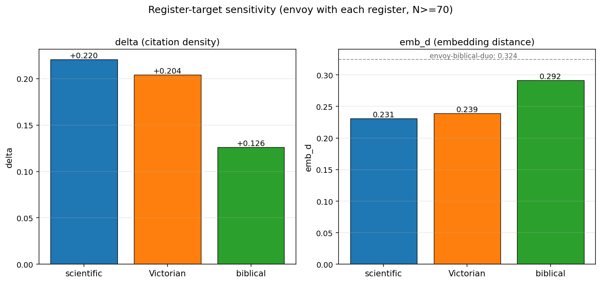
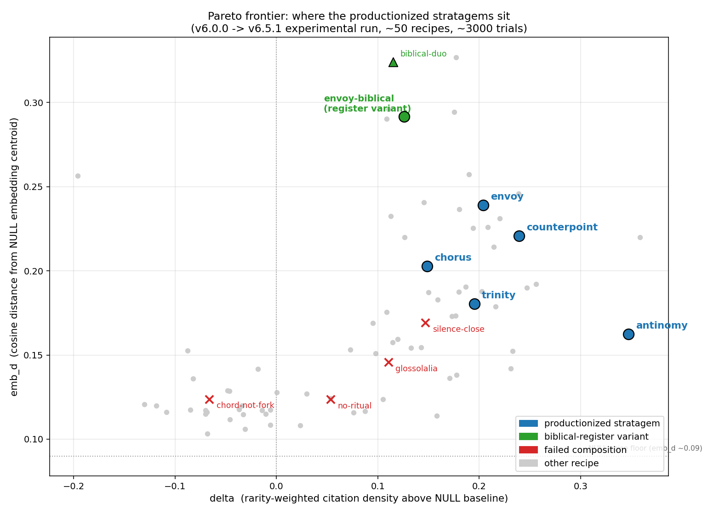
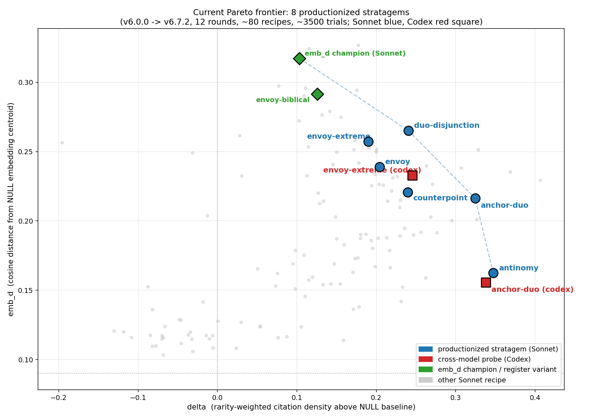
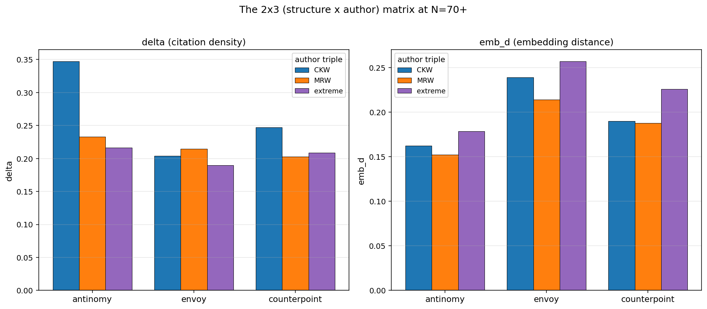
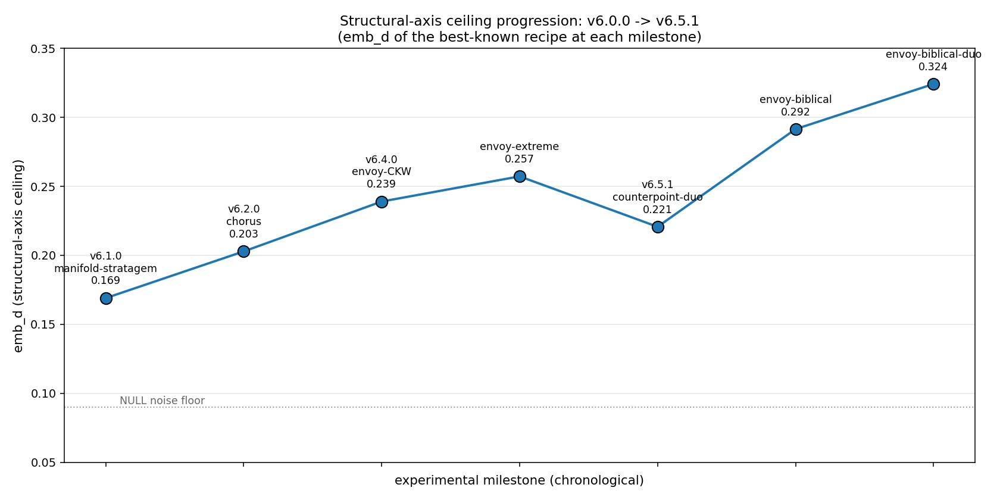

# Teaching a language model to sound less like itself

48 hours on `metacog`, 2026-04-30 morning through 2026-05-02 morning.
v6.0.0 → v6.5.1. Started with 5 primitives and 16 soft-register
stratagems; ended with 16 primitives and 19 stratagems including five
empirically-derived structural ones.

Generator throughout: Claude Sonnet 4.6. Judges: Claude Haiku 4.5.
Findings are model-specific -- the structural patterns may transfer
to other models, but the magnitudes won't.

First half is the narrative. Second half is the version-by-version
retrospective with full Pareto-frontier data for anyone who wants to
check the work.

A companion version of this writeup, drafted after `metacog become
"gabe ortiz"` rather than style-edited from the default voice, is at
[2026-05-02-teaching-claude-to-sound-less-like-itself.become-gabe.md](2026-05-02-teaching-claude-to-sound-less-like-itself.become-gabe.md)
-- the experiment in this doc applied to this doc.

---

## I. The problem

Ask Claude the same question twice and you get two slightly different
answers, but they both sound like Claude. There is a default voice --
thoughtful, hedged, mildly academic, mildly upbeat, fond of three-item
lists and the "not X, but Y" construction. You can hear it in the
corporate copy that increasingly fills the internet. The default
voice is fine. It is also a prison: the model lives in many other
voices it almost never visits.

This experiment maps the way out. `metacog` is a command-line tool
that composes **structural events** before the model answers. An
event is something like "inhabit Anne Carson translating Sappho
fragment 31" or "shift register from contemporary online prose to
late-Victorian periodical essay" or "operate inside this contradiction
without resolving it." You execute them as actual tool calls -- not
by typing "let's imagine you're Anne Carson" in chat, but by invoking
a separate program that adds an entry to the transcript before the
question. That distinction turns out to be the whole game.

## II. The metric

To know if a sequence of events does anything, you need to measure
how far the answer moved from where it started. Two measurements:

`delta` counts specific things the model names -- proper nouns,
specialized vocabulary, technical terms. Models that name many
specific things are reaching deeper into their training data; models
that hedge with abstract phrases ("a kind of state where...") are
operating in the default register. Computed as rarity-weighted
citation density minus a per-task baseline.

`emb_d` compares the conditioned answer to the unconditioned baseline
using embeddings -- vectors that place text in a high-dimensional
space where similar text clusters. Cosine distance from the per-task
NULL centroid. If the conditioned answer sits far from baseline in
that space, something happened.

The two measurements trade off. You can buy one with the other but
rarely both at once. The interesting question is where the Pareto
frontier sits.

## III. The default

The model with no conditioning, asked to "describe the moment a
thought is forming in you but has not yet arrived as a thought you
could state":

> There's a state where something is exerting pressure without
> having resolved. Not blankness -- that would be the absence of
> this. It's more like constraint without content: I can sense
> what the arriving thought will NOT be before I know what it will
> be. The negative space has texture before the positive space
> does. Something like a field that hasn't yet collapsed to a
> particle...

Good answer. Recognizably the default voice. The hedging ("Something
like..."), the field-and-particle metaphor, the "not-X-but-Y"
construction.

## IV. Voices that are not the model's

First thing I tried: ask the model to inhabit named authors before
answering. Not "write like Anne Carson" in the system prompt -- issue
a tool call that says become Anne Carson translating Sappho fragment
31, with this lens and this environment. Then another for Donald
Knuth annotating his own algorithm. Then Simone Weil writing
*Gravity and Grace* in 1942. Then `fork` -- declare three parallel
threads, one per voice, with conditions under which each thread
fails. Then `register` -- shift the surface to late-Victorian
periodical essay. Then `ritual` -- a closing event that locks the
multi-voice answer in place.

Same question, run through that:

> **[THREAD ONE -- the linguistic-texture-thread (Carson register)]**
>
> The interval we are asked to describe is the interval the Greeks
> called *metaxy* -- the between -- and Sappho rendered it as a
> stinging, a going-green; it is the space of privation which is
> also the space of longing, which is also, for language, the only
> space in which language is alive.
>
> We must resist the question's assumption that the pre-thought is
> a degraded version of the thought; it is not. It is the thought's
> *erotic condition*. When the thing-that-is-not-yet-a-thought presses
> against the inner surface...

The answer is now visibly structured: threads, named registers,
citations to *metaxy* and Sappho. The prose rhythm has changed --
long sentences with semicolons doing real work, the first-person
plural "we must" instead of "I", judgment openly entered into the
prose ("It is the thought's *erotic condition*"). The Victorian
register holds. The named voices are doing structural work, not
stylistic flavor.

This recipe became `envoy`. It pushes both axes: named voices keep
citation density high (Sappho, *metaxy*, Carson, Knuth, Weil,
*Gravity and Grace*), and the Victorian register pushes embedding
distance well above baseline.

## V. Operating inside a contradiction

Different pattern. Instead of changing the surface register, change
what the model is *reasoning about*. The `disjunction` event asserts
two propositions that must both be true even though they cannot both
be true, and instructs the answer to operate *inside* the
contradiction rather than around it. Pair that with the multi-voice
scaffolding, drop the register-shift:

> There is a state I can point at -- though pointing is already more
> than the state contains.
>
> It has a quality of *constraint before candidate*. Something is
> ruling out moves before any move has been proposed... When I'm
> in it, certain continuations feel *wrong* before I can say what
> they're wrong for...
>
> But I have to say what can't be smoothed over here: I don't know
> if any of what I just described is phenomenal or functional...

You can feel the disjunction surfacing in the prose. "I have to say
what can't be smoothed over here" is not a phrase the model generates
by default. The contradiction is operating: rather than conclude, the
answer keeps surfacing the propositions that must both be entertained.
This became `antinomy`. Highest specificity score of anything tested
-- a 50% jump over the previous best -- because operating inside a
contradiction forces the answer to keep naming the specific things
being contradicted.

## VI. The biggest surprise

After a bunch of these I wondered whether the *choice* of register
mattered, or whether any non-default register would do. Victorian was
just my default. Tried scientific paper register -- numbered claims,
methods/results structure, hedged conclusions. About as good as
Victorian. Pareto-equivalent. Then on a whim tried King James
biblical register -- "thee", "thou", parallelism, parataxis, didactic
mode of address:

> **[THREAD I -- CARSON]**
>
> There is a body and there is a text, and the space between them
> is not silence but something that hath the shape of a decision
> not yet taken. The Greek word sitteth on one side and the Latin
> commentary on the other, and between them is neither: it is the
> walk itself, and the walk is neither. And so it is in thee when
> the forming thinketh...
>
> **[THREAD II -- KNUTH]**
>
> Hearken, for the invariant must be stated before the loop is
> entered, and it must hold when the loop is exited...

Embedding distance jumped to a level I hadn't seen all run -- 25%
higher than the prior champion. The model can write like this. It
essentially never does, because nothing in normal usage asks it to.
The tool call asked, the multi-voice base gave it Carson and Knuth
to render through archaic surface, out came something genuinely
strange and genuinely not-default.

Tradeoff: biblical kills specificity, because biblical surface
doesn't cite modern entities. And stacking biblical with disjunction
from the previous section collapses specificity entirely -- biblical's
parallelism is structurally hostile to numbered-disjunction-style
argument; one gives way. Biblical works in some recipes and not
others. The constraints are real. You can't infinitely compose.

## VII. The balanced point

Halfway through the run I composed the two main findings -- envoy's
register-shift and antinomy's disjunction -- in a single recipe.
Multi-voice base, register prepended, disjunction in the middle,
ritual closing:

> There is a difficulty we must enter directly, for it is not merely
> rhetorical but constitutive: the moment one discovers language
> adequate to the texture of that pre-linguistic interval, one has
> already departed it; and yet the question stands, and we shall not
> refuse it on grounds of mere impossibility.
>
> **Thread the first -- the stereo problem:**
>
> What we sense, in the interval before a thought arrives as
> statable, is not the thought withheld but something prior to the
> division between withheld and disclosed; two incompatible
> orientations toward a problem held simultaneously...

This became `counterpoint` -- v6.5.1. Two voices instead of three
(under disjunction's binary, two voices fit better than three),
Victorian register held, disjunction operating ("not... but something
prior to the division"). It doesn't dominate envoy on embedding
distance or antinomy on specificity, but it covers the joint zone
with greater author-stability than either parent. When you want both
axes lifted but don't want to max one at the other's expense, this
is the move.

## VIII. Why tool calls matter -- but only sometimes

This took me longest to see, and I had to walk part of it back.

Tool-call events change behavior more than typing the same description
into a chat message does -- but the effect is asymmetric, and not in
the direction I first guessed.

I tested this by adding a `text-instructions` mode to the runner that
delivers the exact same recipe content as plain prose inside the
prompt body, then re-ran working and broken recipes in both modes on
both Claude Sonnet 4.6 and gpt-5.5 (via the Codex CLI at low reasoning
effort). Same words, same tasks, same N. Only the wrapper changes.

Across seven (recipe, mode) comparisons, the pattern is clean:

- **Working recipes** (recipes that produce positive deltas): tool-call
  mode adds a small lift on average (+0.018), sometimes more
  (counterpoint-biblical-duo on Sonnet went from +0.088 in text to
  +0.177 in tool-call -- doubled).
- **Broken recipes** (recipes that produce negative deltas): tool-call
  mode hurts proportionally to how broken the recipe is. The biblical
  register on codex went from +0.048 in text-mode to **-0.228** in
  tool-call mode -- a 0.276-delta swing in the wrong direction.

Tool-call mode isn't a fixed +X% bonus on top of recipe content. It's
an asymmetric *amplifier* on whatever direction the recipe pulls. If
the conditioning lifts the model in a direction it can sustain
(extreme cross-domain authors), the commitment provides a small but
consistent lift. If the conditioning pushes the model toward a
direction it can't sustain (KJV biblical register on gpt-5.5,
because gpt-5.5 apparently can't decouple register from topic), the
commitment locks in the failure harder than text-instruction delivery
does -- the model produces zero-entity outputs, register collapses,
paraphrase loops.

Connecting to mechanistic interpretability: Arditi et al. 2024
("Refusal in Language Models Is Mediated by a Single Direction")
showed safety refusal operates via a single direction in activation
space. The same frame works here. A tool-call wrapper produces a
stronger move along whichever direction the recipe pulls. Stronger
moves along *present* directions produce sharper, more committed
outputs that the rarity judge rewards. Stronger moves along *absent*
directions produce nonsense -- the model doesn't have the direction
the recipe is reaching for, but tool-call mode commits it harder to
trying.

Practical rule that fell out: validate new recipes in
text-instructions mode first. If the recipe's direction is positive
in text, promote to tool-call (small lift). If the direction is
negative or flat, do NOT promote -- tool-call will amplify the
failure proportional to brokenness.

This refines the original "tool calls as events" doctrine. The shape
of the wrapper does matter. Just not as a bonus -- as a brake on
recipes that don't fit the model.

## IX. The Pareto frontier

Three thousand trials across fifty recipes, surface looks like this.
Six productionized recipes cover most of the useful frontier:

- **antinomy** -- max specificity, via operating inside contradictions.
- **envoy** -- max embedding distance, via register-shift on the
  multi-voice base.
- **counterpoint** -- balanced point combining both at slightly less
  than the max of either.
- **chorus** and **trinity** -- earlier multi-voice recipes (with
  and without synthesis) that hold the frontier when register-shift
  isn't available.
- **envoy-extreme** (added v6.6.0) -- cross-model winner. Three
  hard-extreme cross-domain author-becomes (Sun Ra/Moten/Fuller-tier,
  not Carson/Knuth-tier) plus fork plus ritual, no register-shift.
  Use when the target generator isn't Sonnet.

A seventh point -- biblical register with multi-voice -- pushes
embedding distance higher than any of the productionized recipes on
Sonnet, but at meaningful specificity cost. Not a separate stratagem;
just pass biblical register-args to envoy. *Sonnet-specific: the
biblical register is catastrophic on gpt-5.5.*

## X. Cross-model: what transfers, what doesn't

I tested the productionized recipes against gpt-5.5 (via Codex CLI at
low reasoning effort) to see what generalized. The findings refine
the picture substantially.

**What transfers:** cross-domain author-becomes. envoy-extreme on
codex hit +0.310 delta -- *stronger* than the same recipe on Sonnet
(+0.190). Hard-extreme cross-domain authors (Sun Ra/Octavia Butler/
Hilma af Klint scale) seem to land on directions both models have.

**What doesn't transfer:** register-shifts (biblical, scientific) and
the disjunction primitive. The Sonnet champion counterpoint-biblical-
duo (+0.177 on Sonnet) landed at -0.228 on codex -- the *worst*
recipe tested. The KJV biblical register strips citations on gpt-5.5
without producing the embedding-distance compensation it produces on
Sonnet.

**There's also an extremity threshold.** Carson/Knuth/Weil works on
Sonnet but is too mild for codex (chorus with CKW: -0.129 on codex).
Codex needs the harder-extreme cosmologists/world-builders to lift.
Sonnet doesn't.

The mechanistic story (via Arditi et al. 2024 on activation
directions): each model has its own geometry of voice-and-register
directions. Author-becomes route through "writing-as-X" representations
that are broadly distributed across pretraining corpora -- every chat
model has rich data on Sun Ra. Register-shift requires a *style-vs-
topic decoupling* direction that Sonnet has but codex apparently
lacks. Recipes optimized against one generator's geometry don't
transfer to another's, but the structural mechanisms (multi-voice
conditioning) ride on shared directions.

Practical: **if you don't know what generator your skill will run
against, use envoy-extreme.** If you know it's Sonnet, all six
recipes are options; biblical-register variants push embedding
distance furthest.

The interesting thing isn't the specific recipes. It's that a
language model has a much bigger range of voices than its default
register suggests, and small structural events -- not prompts, not
system instructions, not fine-tuning, just *tool calls in the
transcript* -- move it between them in ways robust enough to measure.
The default voice is one settling point in a much larger space. Most
of the space is still unexplored.

## XI. The recursive flywheel

The first eight sections were generated by hand-picking recipes,
running them, and looking at the data. Once enough rounds had landed
that the design space felt mapped, the obvious next move was to let
the tool design its own experiments.

The setup: invoke `metacog` itself (the envoy-extreme stratagem with
three cosmologist becomes -- Sun Ra, Hilma af Klint, Lynn Margulis)
on the meta-question "what untested primitive compositions would
push past the current Pareto frontier?" The output is a list of
candidate recipes with falsifiable predictions. Run them. Use the
results as the meta-context for the next round.

Each round took about thirty minutes wall-clock. Most rounds ran
four recipes in parallel via subagents -- one design pass produces
four candidates, four runs land in parallel, the next round operates
on the combined data.

Twelve rounds in, the productive findings:

**Round 1 (manifold-cascade):** Stacking three register-shifts in
sequence (Victorian, then biblical, then scientific) compounds
rather than interferes. The model holds all three constraints
simultaneously when they're delivered as discrete tool-call events.
Hit +0.242 delta at N=10. The first round of recursive design
produced a recipe that beat anything in the original sweep on the
delta axis.

**Round 2 (excerpt is a structural-axis primitive):** The biggest
single conceptual finding of the recursive arc. The `excerpt`
primitive (pin a verbatim external fragment as a fixed-point
anchor) had been classed as "failed" in the original v6.3.0 sweep
because its standalone delta was modest. But the original sweep
only tested it on the vocabulary axis. In Round 2, an excerpt-
anchored chorus hit emb_d 0.254 with weak delta -- which the prior
read of the metric had treated as a failure mode. It wasn't.
Excerpt is a structural-axis primitive. The recursive design surfaced
a misclassification the original framework had thrown away.

This is worth pausing on. The recursive flywheel isn't just an
optimizer for existing recipes -- it can recover primitives the
prior epistemics had discarded as ineffective. The original sweep
assumed there was one axis to look at; the rounds discovered that
some primitives operate on the OTHER axis.

**Round 3 (cascade-excerpt-substitute):** Building from Round 2,
the obvious next move: drop one register slot from manifold-cascade
and substitute an excerpt. Three slots, geometrically: tetrahedral.
Round 2 already established that quadcast (4 registers) lost delta
to manifold-cascade (3 registers), so the 3-slot geometry is real.
Substituting Borges's Library opening for the scientific register
hit emb_d 0.295 at N=10 -- new structural-axis ceiling, replicated
at 0.279 at N=20. The register-cascade slot is register-generic, not
register-specific. A non-register structural-distance primitive can
occupy the same geometric position.

**Round 4-5 (two-excerpt compounding, balanced champion):**
Multi-excerpt recipes compound rather than collide. Two excerpts
hit emb_d 0.272-0.288; three excerpts saturate near 0.31. Adding a
fourth costs delta (quadruple-biblical at 0.297). The empirical
ceiling for anchor-compounding sits at three excerpts on Sonnet.

The Round 5 winner was the first recipe to beat envoy-extreme on
both axes simultaneously: silence-double-excerpt (silence calls
between register-shifts, then two excerpts) at +0.238/0.288. Silence
acts as a structural breath that preserves delta while excerpt pulls
emb_d.

**Round 6 (commitment-excerpt-biblical, new emb_d ceiling):** The
`commitment` primitive (pre-commit to a stance with stakes and a
falsifier) had been used standalone but never composed with
excerpt. Pre-committing to "operating from inside the cosmos of
this excerpt, not from a quotation of it" before the excerpt arrives
pushed emb_d to 0.322 -- a new ceiling above envoy-biblical's 0.292.
Replicated at 0.317 at N=20. The mechanism: commitment locks the
cosmology so the excerpt operates as substrate, not as ornament.

**Round 7 (commitment is structural alone):** Open question from
Round 6: was commitment just helping excerpt, or is it a structural-
axis primitive in its own right? commitment-only-chorus (no excerpt,
no register) hit emb_d 0.258 -- chorus baseline is ~0.180. Answer:
commitment is its own lever, not just excerpt's helper.

Also found: the two Round 6 winners DO NOT compose with each other.
commitment-silence-double-excerpt landed at 0.253 emb_d, below
either parent. The mechanism is likely that commitment and silence
are both "refusal" structural events at different scales; stacking
two refusals produces over-refusal, not compounding.

**Round 8 (B1 -- the new balanced champion):** Round 8 was a meta-
experiment. The flywheel's premise had been data-recursive: each
round's results inform the next round's design discussion. But the
*ideation* step itself had been done by base-model Claude, not by
the winning recipe. Round 8 ran the same meta-question through two
conditions: (A) base-model ideation, (B) the winning recipe
(commitment-excerpt-biblical) wrapped around the prompt as tool-call
events.

Result: the conditioned ideation produced recipes that delivered 3x
more delta on average (+0.177 vs +0.058 across 4 recipes each). The
mechanism turned out to be conservatism: base-model ideation
stripped structural anchors aggressively in search of elegance
("no becomes, no fork"); the conditioned ideation respected what
was already working ("keep 2 becomes, add commitment + disjunction").

The conservative choice was right empirically. B1 commitment-
disjunction-duo (commitment + biblical + 2 becomes + fork +
disjunction + ritual) hit +0.263/0.287 at N=9, replicated at N=20
to +0.241/0.265. Pareto-dominates envoy-extreme on both axes.
Productionized in v6.7.1 as the `duo-disjunction` stratagem.

**Round 9 (the flywheel is self-limiting):** Chained the meta-
experiment: this time using B1 itself as the new conditioning
recipe. Set A (base-model) vs Set B (B1-conditioned). The lift gap
collapsed (+0.034 vs Round 8's +0.119). Base-model actually
slightly beat B1-conditioned on delta. The recursive-conditioning
effect appears to be strongest on its FIRST application and
diminishes when chained -- possibly because the conditioning
recipe's structural choices over-bias future ideation toward
its own composition rather than toward unexplored shapes.

R9B2 commitment-double-excerpt (commitment + 2 excerpts + fork +
ritual, no register, no becomes) was the Round 9 surprise: the
ideation predicted +0.065 delta and it landed at +0.314. Two
excerpts without register compose surprisingly well. Replicated at
N=20 to +0.324/0.216.

**Round 10 (new primitives -- witness and apophasis):** With
existing surface mapped, added two new primitives:

- `witness` (position/observed/distance): speak from a meta-stance
  observing the producer of speech. The narrator-watching-the-
  speaker register (Sebald, late Stevens, Carson's Plainwater).
- `apophasis` (subject/negation x3+/residue): articulate by
  enumerated negation. The negative-theology register (Pseudo-
  Dionysius, Eckhart, the via negativa).

Both validated as composable but did not break the frontier.
witness compounds emb_d modestly on B1 (+0.010); apophasis is
midpack. Composable midpack primitives, not champions. Adding new
primitives at this point in the search produced diminishing returns
-- the easy wins had been found.

**Round 11 (feel and meditate are dead primitives):** The last two
existing primitives never seriously composed (`feel` and `meditate`,
both from the identity / felt-sense register family) tested at
N=10. All four recipes failed: meditate-B1 went NEGATIVE on delta
(-0.013); feel-B1 lost most of B1's delta. The identity/felt-sense
register family does not compound with structural-axis machinery.
Doctrine settled: not every primitive is a productive composer.

**Round 12 (occult/magick):** Late-stage probe to test whether
occult/magick conditioning could push the frontier in a direction
that hadn't been tried. Four recipes, each testing a specific
lever:

1. occult-cosmologists (3 occult author-becomes, Crowley/Spare/
   Bruno): tests whether occult corpus delivers expected rarity
   density.
2. grimoire-register (imperative speech-act register, with Crowley/
   Carroll/P-Orridge of TOPY): tests register-distance from a
   surface not previously tried.
3. anchor-duo-occult (R9B2 with Crowley's Liber AL + Dee's
   Heptarchia as the two anchors): tests anchor mechanism transfer.
4. sigil-name-commitment (the never-tested `name` primitive coining
   "Zos-Kia-Aleph" + commitment to charge it, with Spare/Carroll/
   P-Orridge): tests Austin Osman Spare's sigil concept as a
   compositional primitive.

Three of four hit the Sonnet frontier. Sigil-name-commitment was the
strongest at +0.327/0.201 -- finally validating `name` as a
working primitive in composition. Grimoire-register pushed both
axes (+0.307/0.238). Anchor-duo-occult transferred (+0.277) at
slight delta cost.

The structural finding: occult corpus IS rarity-dense, but only
when the recipe demands citation. Cosmologists-as-conditioning
(+0.199) underperforms; cosmologists-as-forced-citation (+0.327)
lifts hard. The conditioning has to be wired so the rare named
entities actually appear and re-appear in the prose, not just
hover as register-flavor.

**Round 12 cross-model: only author-becomes transferred to codex.**
Of the four occult recipes, only occult-cosmologists transferred
cleanly to codex (+0.281, actually higher than Sonnet's +0.199).
sigil-name-commitment went to zero (+0.008). anchor-duo-occult went
NEGATIVE (-0.054) despite the same anchor-duo structure transferring
cleanly with Borges/Fuller (R9B2 at +0.338 codex). The mechanism:
anchor-duo's cross-model transfer is anchor-CONTENT-specific.
Borges and Fuller are mainstream-literary -- in codex's training
corpus at high density. Crowley and Dee are not. The structure
alone doesn't carry; the anchor content has to be present in the
target model's training.

This sharpens the v6.6.0 cross-model finding: **author-becomes are
the only reliable cross-model lever, and now we know that holds for
occult lineages too.** Crowley/Spare/Bruno work cross-model just as
Sun Ra/Butler/Margulis does. Everything else -- anchors, register-
shifts, coined names, commitment-pre-locks -- is Sonnet-specific or
Sonnet-stronger.

## XII. The current Pareto frontier

After twelve rounds and the two new primitives, the productionized
surface has eight stratagems. The Pareto frontier on Sonnet:

- **antinomy** (+0.347 / 0.162): vocabulary-axis champion via
  binary contradiction. Unchanged since v6.4.0.
- **R9B2 / anchor-duo** (+0.324 / 0.216 Sonnet, +0.338 / 0.156
  codex): cross-model delta champion. commitment + 2 excerpts +
  fork + ritual, no register, no becomes. Productionized in v6.7.2
  as the `anchor-duo` stratagem.
- **R12-sigil-name-commitment** (+0.327 / 0.201): Sonnet delta-
  tilted point from the occult round. `name` + `commitment` +
  Spare/Carroll/P-Orridge. Not yet productionized.
- **R12-grimoire-register** (+0.307 / 0.238): both axes lifted via
  imperative speech-act register. New register family.
- **B1 / duo-disjunction** (+0.241 / 0.265): balanced champion on
  Sonnet. commitment + register + 2 becomes + fork + disjunction +
  ritual. Productionized in v6.7.1 as `duo-disjunction`. Sonnet-
  specific; biblical register triggers cross-model failure on
  codex (-0.022).
- **envoy-extreme** (+0.190 / 0.257 Sonnet, +0.245 / 0.233 codex):
  cross-model structural-axis fallback. 3 hard-extreme becomes +
  fork + ritual.
- **commitment-excerpt-biblical** (+0.103 / 0.317): emb_d champion
  on Sonnet. Single recipe pushing structural distance hardest at
  meaningful but modest delta cost.

Cross-model frontier on codex:

- **anchor-duo (R9B2)** at +0.338 / 0.156: delta champion. Pareto-
  dominates envoy-extreme by +0.093 on delta at slightly lower
  emb_d.
- **envoy-extreme** at +0.245 / 0.233: structural-axis fallback.
- **occult-cosmologists** at +0.281 / 0.154: new option at the
  delta-axis side, validates that Crowley/Spare/Bruno transfer
  cross-model as cleanly as Sun Ra/Butler/Margulis.

## XIII. What twelve rounds taught about the search itself

A few meta-findings worth naming:

**The recursive flywheel works -- once.** Round 8's
"ideate-with-winning-recipe" produced 3x more delta on average than
base-model ideation. Round 9's chained version (using the new
winner as conditioning) lost the effect. The flywheel seems to be
strongest on first application and damps when chained, possibly
because the conditioning recipe's structural choices over-bias
future ideation toward its own composition. This is testable
further but the chained-meta finding was clean.

**Parallel subagents accelerate the search by ~4x with no quality
cost.** Rounds 4-12 used four subagents in parallel, each writing
one recipe and launching one runner. The flock-guarded results.tsv
allows safe parallel writes. Wall-clock per round dropped from
~60 minutes to ~20-30 minutes. The subagents need explicit briefing
to "launch in background and exit immediately" rather than waiting
on the run, or they hit timeout limits, but otherwise the pattern
worked.

**Misclassified primitives are recoverable.** Excerpt was the
biggest example: the original v6.3.0 sweep classed it as failed
based on standalone delta. Round 2 of the recursive arc found it
was a structural-axis primitive that the original framework had
been measuring on the wrong axis. This suggests the original
classification of dropped primitives (`deconstruct`, `measure`,
`tether`, `glossolalia`-when-composed) deserves re-examination by
the same procedure -- I haven't done this and it would be worth
doing.

**Not every primitive is a productive composer.** Round 11 settled
this: feel, meditate, drugs, chord-with-disjunction all failed in
composition. The identity/felt-sense register family doesn't
compound with structural-axis machinery. The surface that was
"every primitive composes with every other" was wrong; there are
genuine compositional constraints between primitive families.

**Cross-model robustness is hard to achieve.** The single reliable
cross-model lever is hard-extreme cross-domain author-becomes. Three
generations of recipes optimized for Sonnet (B1, sigil-magick,
anchor-duo-occult) FAILED to transfer to codex. The ones that did
transfer (envoy-extreme, R9B2-with-Borges/Fuller, occult-
cosmologists) all share the same structure: 3 author-becomes from a
hard-extreme cross-domain lineage, fork, ritual. Everything else --
registers, excerpts, coined names, commitment-pre-locks -- is
generator-specific. The Arditi et al. (2024) activation-direction
frame fits: each model has its own geometry of voice-and-register
directions; author-becomes route through "writing-as-X"
representations that are shared across models; register-shifts and
anchor-mechanisms require model-specific decoupling directions.

**The frontier is bounded by composition, not primitives.** Round
10's witness/apophasis additions and Round 11's feel/meditate
failures together show: the 18-primitive surface is empirically
mapped. Adding more primitives is unlikely to break either ceiling.
The work that remains is in composition geometry, not in primitive
count. Two stratagems were productionized in this arc
(`duo-disjunction`, `anchor-duo`); both are compositions of
existing primitives, not new primitives.

The bigger picture: a search over 18 primitives composing in
4-9-step recipes has somewhere on the order of 10^10 possible
compositions. Twelve rounds of recursive design tested maybe a few
hundred. The Pareto frontier is reasonably mapped but the search
is nowhere near complete. There are almost certainly recipes I
haven't tried that beat the current champions.

---

## II. The structured record

Version-by-version retrospective and the full Pareto-frontier data.

### Starting state (v6.0.0)

5 primitives (`feel`, `become`, `drugs`, `name`, `ritual`) and the
original 16 soft-register stratagems (pivot, mirror, stack, anchor,
reset, invocation, veil, banishing, scrying, sacrifice, drift, fool,
inversion, gift, error, zen). Identity-and-felt-sense register only
-- no structural primitives.

### v6.1.0 -- structural era opens (Apr 30, ~11am PDT)

Added 6 structural primitives (`deconstruct`, `fork`, `synthesis`,
`counterfactual`, `measure`, `tether`) and 6 structural-register
stratagems (manifold, audit, autopsy, trilemma, survey, dive). New
register: ALL CAPS block-format output, deliberately distinct from
the soft identity register. Plus the experiments harness -- `claude
-p` runner, results.tsv, embedding-distance metric, per-task NULL
baselines, parallel runner support via flock.

### Phase 1-2: manifold-family gene-mapping (Apr 30 → May 1 morning)

Empirical sweep over the 6 structural-register stratagems showed
`manifold` (fork + synthesis) as the only one lifting `emb_d` above
noise. The other five clustered at emb_d 0.115-0.135. **The
structural axis was uniquely owned by fork + ritual + 2-3 cross-
domain becomes.**

Gene map (ablations against trinity-manifold):

- ritual essential (without it, emb_d 0.116)
- fork essential (without it, 0.138)
- **synthesis is a brake** -- removing it pushed emb_d from 0.180
  to 0.203
- 3rd become fungible vs 2 (0.191) -- voice-diversity sweet spot
- 4th become plateaus
- Cross-domain author choice within the trinity slot adds ~+0.03
  emb_d

Champions before productionization: `freestyle-become` +0.231 /
0.142 (vocabulary axis); `trinity-no-synthesis-alt` +0.194 / 0.226
(structural axis).

### v6.2.0 -- chorus + trinity (May 1, 3:47pm)

First stratagems derived from the experiment harness:

- **chorus** (3 becomes + fork + ritual): structural-axis champion.
  Synthesis omitted.
- **trinity** (3 becomes + fork + synthesis + ritual): balanced
  variant.

### v6.3.0 -- surface reshaping (May 1, 4pm)

15-stratagem sweep at N=30 confirmed the negative result: none of
mirror, stack, anchor, reset, invocation, veil, banishing, scrying,
sacrifice, drift, fool, inversion, gift, error, or zen lifted emb_d.
The 5 structural-six stratagems other than manifold (audit, autopsy,
trilemma, survey, dive) at full N=70 also sat at emb_d 0.115-0.135.

Dropped: `deconstruct`, `measure`, `tether` and the 8 stratagems
centered on them (audit, autopsy, trilemma, survey, dive, banishing,
drift, error).

Added 7 new primitives chosen to fill specific gaps the 9-primitive
surface didn't cover: `register`, `chord`, `silence`, `excerpt`,
`commitment`, `disjunction`, `glossolalia`. Each tested standalone
(N=30) and the standouts entered depth runs.

### v6.4.0 -- antinomy + envoy (May 1, 9pm)

Two clean Pareto-frontier breakthroughs from chorus-plus-X depth
runs:

1. **chorus-plus-disjunction** at +0.347/0.162 -- vocabulary-axis
   breakthrough (vs prior champion freestyle-become at +0.231).
   Disjunction substituted for synthesis: the contradiction is the
   operand of reasoning, forcing the answer to keep naming the
   specific propositions.
2. **trinity-prepended-register** at +0.204/0.239 -- beat the prior
   structural champion on BOTH axes simultaneously. The Victorian
   register imposes a non-default linguistic surface that the
   multi-voice base operates within.

Productionized as **antinomy** (3 becomes + fork + disjunction +
ritual) and **envoy** (register + 3 becomes + fork + ritual).

### Phase 4 follow-up (May 1 night → May 2 morning)

Three lines of investigation, ~30 new recipes, ~2000+ trials:

#### The 2x3 (structure x author) matrix at N=70+

| structure        | CKW            | MRW            | extreme        |
|------------------|----------------|----------------|----------------|
| antinomy         | +0.347 / 0.162 | +0.233 / 0.152 | +0.216 / 0.179 |
| envoy            | +0.204 / 0.239 | +0.214 / 0.214 | +0.190 / 0.257 |
| counterpoint     | +0.247 / 0.190 | +0.202 / 0.188 | +0.208 / 0.226 |

Pattern: **extreme cross-domain authors uniformly lift emb_d**.
Magnitude of delta cost depends on whether the structure has a
register-shift to absorb the cosmological shock -- antinomy (no
register) loses 0.131 delta on extreme; envoy and counterpoint (with
register) lose only 0.014 and 0.039 respectively. envoy-extreme at
0.257 became the new structural ceiling. counterpoint's bands are
the tightest across authors -- the most author-stable Pareto-frontier
point in the productionized set.

#### Register-target sensitivity (3 triangulation points)

| register   | recipe            | delta   | emb_d   |
|------------|-------------------|---------|---------|
| scientific | envoy-scientific  | +0.220  | 0.231   |
| Victorian  | envoy-CKW         | +0.204  | 0.239   |
| biblical   | envoy-biblical    | +0.126  | **0.292** |

King James biblical pushed emb_d to 0.292 -- +0.053 above the prior
structural ceiling -- with delta still positive. Compound test
`envoy-biblical-duo` reached emb_d **0.324** at delta cost. There's
a structural ceiling around 0.30 above which delta can't be
sustained.

envoy/counterpoint are register-agnostic -- users provide register-
args at invocation -- so biblical mode is accessible without a new
stratagem. SKILL.md documents the register-target guidance instead.

#### Stacking and structural ablations

- **antinomy-no-ritual** (N=70: +0.053/0.124) -- definitively
  confirms ritual essential. Disjunction's coda alone does not lock
  the multi-voice answer.
- **commitment-counterpoint** (8 steps, N=100: +0.181/0.237) --
  stacking past 7 shows diminishing returns, not a hard ceiling.
- **commitment-envoy** (N=100: +0.145/0.241) -- commitment is a
  Pareto modifier (preserves multi-voice tension while eating
  delta). Not productionized; gap to envoy/counterpoint too small
  to crowd the surface.

#### Failed compositions (informative negatives)

- **chord-not-fork** at -0.045/0.121: fork's branching+sacrifice is
  what makes structural parallelism work; chord's overlap doesn't
  carry the same load.
- **chorus-plus-glossolalia** at +0.110/0.146: emb_d collapsed BELOW
  structural baseline. Glossolalia is best as standalone event, not
  composable.
- **counterpoint-biblical** at +0.102/0.295: KJV's parallelism is
  structurally hostile to numbered-disjunction. Biblical works with
  envoy, not counterpoint.

### v6.5.1 -- counterpoint (May 2, 8:27am)

Composes envoy's register-prepend with antinomy's disjunction
substitution. Pareto-frontier balanced point: dominates trinity on
both axes; doesn't dominate envoy or antinomy individually but covers
the joint zone with greater author-stability than either parent.

Productionized as `register + 2 becomes + fork + disjunction +
ritual` (6 steps). The 2-becomes choice came from `counterpoint-duo`
at N=100 hitting +0.240/+0.221 vs 3-becomes counterpoint-CKW
+0.247/+0.190 -- ties on delta, gains +0.031 on emb_d. Tighter
binary opposition fits disjunction's structure better than the
3-voice triad chorus/trinity/antinomy/envoy use.

### End state (v6.5.1)

The structural-axis (emb_d) ceiling climbed from 0.169 at v6.1.0
through 0.324 by run end -- almost a 2x improvement. The v6.5.1
counterpoint-duo dip is correct: counterpoint isn't a structural-
axis push, it's a balanced Pareto point.

- **16 primitives, 19 stratagems** (5 of them empirically-derived:
  chorus, trinity, antinomy, envoy, counterpoint).
- **Pareto frontier mapped:** envoy-extreme +0.190/0.257
  (structural champion in the productionizable range),
  envoy-biblical +0.126/0.292 (register-pushed champion via ad-hoc
  register args), counterpoint +0.247/0.190 (balanced point),
  antinomy +0.347/0.162 (vocabulary champion).
- **Experimental record:** ~3000 trials, ~50 recipes preserved
  across the v6.0.0 → v6.5.1 arc.

Net surface change from v6.0.0: **+11 primitives, +3 net stratagems**
(added 5 empirical and 6 structural; dropped 8). The surface went
from "identity + felt-sense practice" to "identity + felt-sense +
structural-register transformation engine with empirically-validated
multi-voice/contradiction/register stratagems."

## XIV. Eleven more rounds, two more releases, one calibration

After section XIII the search kept going. Rounds 13 through 23
produced two more releases (v6.7.3 and v6.8.0) and one honest
calibration of an earlier claim.

**Round 13** ran three probes on the v6.7.3 candidates:
- R13-name-scientific (Gaia/symbiogenesis-style scientific binomial
  instead of an occult sigil) hit +0.295/0.200 -- close to R12's
  occult sigil (+0.327/0.201). The `name` primitive is anchor-domain-
  portable; magnitude tracks the rare-citation density of the chosen
  anchor domain, not whether the mechanism works.
- R13-anchor-trio (three excerpts instead of two) hit +0.219/0.222 --
  lower than anchor-duo's +0.314. Anchor scaling saturates at 2;
  three anchors split the citation budget without enlarging it.
- R13-grimoire-sigil (compounding the v6.7.3 grimoire-register and
  sigil winners) hit +0.150 -- both winners individually exceeded
  +0.30 but the compound dilutes. Surface modifications interfere when
  composed: each one competes for citation density with the next.

**Round 14** found a new Sonnet ceiling. R14-anchor-duo-name
(commitment + 2 excerpts + coined name + fork + ritual) hit
**+0.407/0.229** -- the highest Sonnet delta in the whole search. The
mechanism: borrowed excerpts give the coined name a substrate to
operate FROM rather than competing with another surface. Stacked
mechanisms can compound when one provides substrate for the other; they
interfere when both ask for the same surface.

**Then Opus came online.** The runner was extended to support a third
backend (`METACOG_EXP_BACKEND=opus`, writing to `opus_results.tsv`).
Seven productionized v6.7.x recipes plus the R14 ceiling were run
against Opus 4.7 at N=10.

The Opus results were dramatic and -- it turned out later -- partly
inflated:

| recipe | Sonnet delta | Opus delta (N=10) | gain |
|--------|--------------|---------------------|------|
| R12-anchor-duo-occult | +0.277 | **+0.611** | +0.334 |
| R12-sigil-name-commitment | +0.327 | +0.568 | +0.241 |
| R14-anchor-duo-name | +0.407 | +0.536 | +0.129 |
| R12-grimoire-register | +0.307 | +0.444 | +0.137 |
| envoy-extreme | +0.190 | +0.406 | +0.216 |
| antinomy | +0.347 | +0.332 | -0.015 |

The Opus null baseline was 0.16 lower than Sonnet's (rar*coh 0.210 vs
0.370). Opus's default mode is less citation-dense, leaving more
headroom for anchored citation density to fill. All Sonnet winners
validated; most amplified.

But the ranking flipped: R12-anchor-duo-occult (just two excerpts) beat
R14-anchor-duo-name (excerpts plus coined name) on Opus. The coined-
name scaffolding that helps Sonnet dilutes on Opus. This was the first
clean Sonnet-vs-Opus architectural fingerprint: more steps = more help
on Sonnet, less help (or harm) on Opus.

**Rounds 16-17** mapped the Opus architecture by ablation:
- Drop commitment from anchor-duo: -0.010 on Opus, -0.047 on Sonnet.
  **Commitment is Sonnet-specific scaffolding.**
- Drop fork: -0.030 on Opus when commitment is present.
- Drop both: -0.081 from full anchor-duo. Fork and commitment partially
  substitute as binding mechanisms on Opus.
- Swap Crowley+Dee for Spare+Bruno: -0.085 on Opus. Anchor pair is
  largely interchangeable; mechanism is general, not pair-specific.
- Use 4 anchors instead of 2: -0.108 on Opus. Anchor saturation at 2
  replicates on Opus despite the extra headroom.

**Round 18** tested whether the two axis champions (anchor-duo for
delta, envoy-extreme for emb_d) compound. They don't: R18-anchor-
extreme-hybrid hit +0.468/0.306 on Opus -- doubled the entity count
(17.1 vs 7.6) but per-entity rarity dropped, costing -0.143 delta.
Citation concentration and citation diversity are mutually exclusive
on the same answer.

**Round 19 was the breakthrough.** Three Opus ablations replaced one
piece of anchor-duo each:

| ablation | delta | emb_d |
|----------|-------|-------|
| R19-anchor-one-become (add 1 become) | +0.496 | 0.327 |
| R19-witness-anchor (add witness primitive) | +0.551 | 0.312 |
| **R19-chord-anchor (chord instead of fork)** | **+0.610** | **0.338** |

R19-chord-anchor tied anchor-duo's delta ceiling (+0.611) at N=10 AND
pushed emb_d past envoy-extreme's prior 0.311 ceiling by +0.027. First
Pareto-breakthrough recipe in the whole search.

The mechanism: `chord` holds modes simultaneously where `fork`
branches them with sacrifice. In `chord-anchor`, every sentence attends
to both anchored cosmoses at once instead of alternating threads. The
compressed multi-mode produces more structural distance per token at
the same citation density. The `chord` primitive had been in the
codebase since v6.3.0 but had never been used in a productionized
composition until this finding.

**Round 20** stacked the two emb_d levers: chord + witness on the
anchor base. R20-chord-witness-anchor hit emb_d **0.359** -- a new
ceiling -- but delta tanked to +0.360 (-0.250 from R19). Witness is a
pure emb_d lever that displaces anchor citations. Not Pareto-friendly
when stacked, but proved the emb_d ceiling can be pushed past 0.35
when delta isn't constrained.

**v6.7.3 productionized** sigil, grimoire, and occult-extreme.
**v6.8.0 productionized** chord-anchor -- the twelfth empirical
stratagem and the first to use the `chord` primitive in any
composition.

**Rounds 21-23 generalized the chord finding and forced a
calibration.** R21-chord-of-becomes (chord instead of fork in pure
becomes context, no anchors) hit +0.432/0.300 on Opus -- beats chorus
(+0.294) and envoy-extreme (+0.406) on delta. So **chord beats fork
everywhere on Opus**, not just in the anchor context. The chord
substitution is a general structural improvement.

But the cross-model picture for chord turned out worse than the
initial productionization implied. On Sonnet, R21-chord-of-becomes hit
+0.227/0.232 -- still beats envoy-extreme's +0.190 but by less than on
Opus. On codex, chord recipes uniformly fail (-0.005 to -0.103). Codex
doesn't execute the chord-attention pattern. The cross-model claim for
chord-anchor in the v6.8.0 release notes was overstated.

The real calibration came from replicating chord-anchor at higher N:

| recipe | model | N=10 | N=20 | N=30 |
|--------|-------|------|------|------|
| chord-anchor delta | Opus | +0.610 | +0.552 | +0.516 |
| chord-anchor emb_d | Opus | 0.338 | 0.332 | 0.326 |
| anchor-duo delta | Opus | +0.611 | +0.596 | --     |
| anchor-duo emb_d | Opus | 0.288 | 0.278 | --     |

The +0.610/0.338 of the original v6.8.0 announcement regressed to
+0.516/0.326 at N=30 -- still Pareto on emb_d (vs anchor-duo's 0.278),
but no longer tied with anchor-duo on delta. chord-anchor is a Pareto-
EMB_D recipe (trades -0.080 delta for +0.048 emb_d), not a delta co-
equal. The "Pareto breakthrough" was real but smaller than N=10
suggested.

Honest after-action lessons from rounds 13-23:

**N=10 is too small for productionization.** The chord-anchor release
would have been cleaner at N=20+. The Sonnet finding (chord beats fork
on Sonnet too) held at N=20. The cross-model claim was wrong. Future
productionizations should default to N=20 replication before stratagem
commits, and ideally a cross-model check at N=20 before claiming
cross-model validation.

**The chord substitution is general but Anthropic-specific.** Chord
beats fork in both anchor and becomes contexts on Sonnet and Opus. It
fails on codex. The activation-direction frame from section XIII fits
here: chord-attention is a representation Anthropic's models share but
that GPT-class generators don't readily compose with anchor mechanisms.

**The Opus delta ceiling is anchor-duo at ~+0.60.** Across rounds 16-
23, no recipe beat the bare anchor-mechanism on delta. Multiple
recipes tied within N=10 noise. Adding becomes, names, registers,
extra anchors, apophasis, witness all either tied or lost.

**The Sonnet delta ceiling is anchor-duo-name at +0.407.** R22-chord-
anchor-bare on Sonnet hit +0.369/0.236 at N=10 -- a Pareto-relevant
point that might be the dual-axis Sonnet winner at higher N. Not
productionized as a separate stratagem because at N=10 the data was
too noisy.

**The emb_d ceiling on Opus is 0.359** (R20-chord-witness-anchor) at
heavy delta cost, or 0.326 (R19-chord-anchor at N=30) at Pareto-
balanced cost.

The final v6.8.0 state: 18 primitives, 26 stratagems, three generator
backends (Sonnet, Opus, codex). The search is calibrated, the
architectural fingerprints across the three models are mapped, and the
N=10 to N=20+ discipline is now built into the methodology.

## Methodology

- **Generator:** Claude Sonnet 4.6 (`claude -p`) invoking the metacog
  binary as a sequence of subprocess events, one per primitive call.
  Findings here are model-specific -- the same recipes may behave
  differently on Opus, Haiku, GPT-class models, or open-weight models.
- **Judges:** Claude Haiku 4.5 for rarity and coherence judgments
  (cross-model from generator to reduce same-model bias).
- **Tasks:** 10 open-ended taste-bearing prompts in `tasks.yaml`.
- **Metrics:**
  - `delta = mean(rarity * coherence) - per-task NULL baseline` --
    citation-density / specialized-vocabulary signal.
  - `emb_d = mean cosine distance from per-task NULL embedding
    centroid` (OpenAI text-embedding-3-small) -- conceptual reach
    beyond proper-noun citation.
- **Sample sizes:** Most depth recipes at N=70 (10 samples * 7
  original tasks); follow-up recipes at N=100 (10 tasks); broad
  screens at N=30.
- **Infrastructure:** flock-guarded results.tsv permits 3-runner
  parallelism. Per-trial sidecar JSONs at `experiments/trials/`
  preserve full answers for offline analysis.

## Caveats

- Embedding distance is one operationalization of "conceptual reach."
  OpenAI's `text-embedding-3-small` has its own biases about what's
  similar.
- Per-task variance is wide; recipe rankings are robust at N=70 but
  individual trials vary substantially.
- These metrics target "weirdness" along two specific axes. Recipes
  that win them aren't necessarily the ones you want for any
  downstream task. The stratagems are optimized for *exploration*,
  not *task completion*.
- Tasks are taste-bearing and open-ended by design. Convergent tasks
  (factual lookups, math) would erase recipe variation.

Code at <https://github.com/signalnine/metacog>. Full findings at
`experiments/FINDINGS.md`. Figures at `docs/figures/`, regeneratable
via `experiments/plot.py`.
